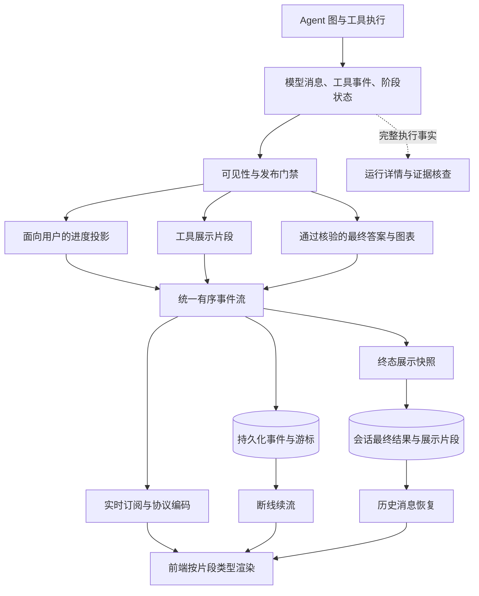
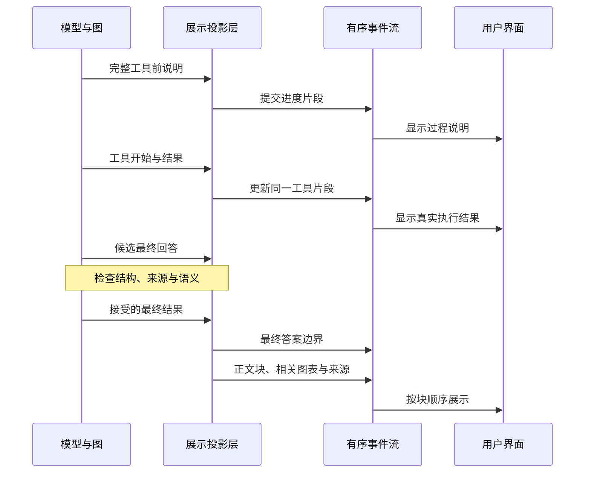
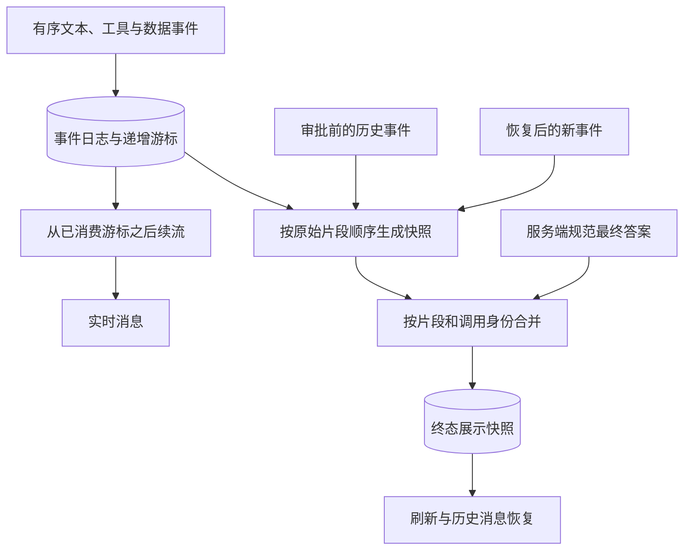

# 会话展示投影：把执行过程变成有序、可信、可回放的对话

## 1. 解决什么问题

Agent 执行会产生模型文本碎片、工具参数、状态变化、内部评估、证据与最终答案。用户需要知道正在做什么、发现了什么、是否需要操作，以及最终结果；直接展示原始事件，容易得到半句话、内部字段、重复段落和错误的完成提示。

展示投影是执行状态与界面之间的一份内容契约。它选择可见信息、保留事件身份与顺序，并支持实时更新和刷新恢复。它不是将内部日志逐字段翻译成聊天正文，也不是额外生成一套脱离真实执行的时间线。

这里讨论面向用户的展示投影。模型请求上下文压缩是另一种投影：它服务于后续模型调用，不应与界面内容或持久化执行状态混为一谈。

## 2. 总体链路



执行事实、展示事件和最终快照分别承担控制、实时呈现与历史恢复职责。界面不应靠解析“已完成”几个字来推断真实运行状态。

## 3. 哪些内容可以展示

| 内容 | 合适的展示方式 | 边界 |
| --- | --- | --- |
| 工具执行前的自然说明 | 一段完整的过程文字 | 预期不能写成已取得结果 |
| 计划与分工摘要 | 面向用户的专用文本字段 | 不直接暴露整份内部契约 |
| 观察后的进展 | 新发现、对任务的影响、尚缺什么 | 先接受评估，再展示完成断言 |
| 工具调用与结果 | 按调用身份更新的可折叠片段 | 隐去敏感参数，保留真实错误 |
| 审批或澄清 | 明确的问题和操作入口 | 与等待状态对应 |
| 最终回答 | 核验后的正文、来源和相关图表 | 候选回答不能提前当成最终结果 |
| 内部评估与完整事件 | 运行详情中的有界记录 | 不混入普通正文 |
| 私有推理与内部摘要输出 | 不作为面向用户的进度 | 进度说明不能等同隐藏思维过程 |

自然进度应由模型根据任务与观察形成，服务端做结构、安全与状态检查。生命周期状态可以由代码控制，但不应通过拼接目标、工具数量和字段标签来假装产生了有内容的研究进展。

## 4. 普通模型消息：先缓冲，再提交

模型 token 是传输碎片，可能与工具参数交错，也可能在不同 chunk 边界出现重复前缀。直接将每个 chunk 追加到聊天正文，会把尚未完成或需要修订的文本变成用户看到的事实。

一种可靠路径是：

1. 每轮建立独立缓冲和轮次身份，收集消息碎片与工具名称。
2. 在完整模型消息边界取得规范文本，优先使用合并后的消息，而非重新拼猜碎片。
3. 如果这一轮包含领域工具调用，将完整说明提交为过程投影。
4. 如果只是结构化最终回答调用，保留候选内容，等待回答门禁。
5. 图结束后提交服务端接受的最终答案，丢弃未发布候选，避免修复轮次重复追加整段正文。

这会牺牲部分逐 token 的即时感，但保留流式事件与工具反馈，并提高正文的稳定性。视觉逐字动画只是界面效果，不能成为内容提交或终态更新的依据。

## 5. 结构化调用：只提取用户文本字段

规划、专家交接和目标评估往往通过结构化输出完成。可以在契约中专门提供面向用户的进度字段，展示层只提取这一字段，不把整段 JSON、工具调用参数或内部判断输出给用户。

某些阶段可以从增量参数中解析该字段的完整文本前缀，用稳定片段身份逐步扩展。同一身份下，重复或缩短的文本不再追加；非前缀重写不能伪装成普通增量，应采用新身份或明确替换机制。

但“能从 JSON 中提取”不代表“已经核验”。目标完成评估、证据充分性判断等敏感阶段，应等待完整契约与服务端门禁通过后才展示。解析错误修复时，还要区分尝试，避免把不同候选拼成一句话。

## 6. 片段身份、顺序与归属

下面是示意契约，字段名称可适配具体协议。

```json
{
  "type": "progress",
  "part_id": "stable-part-id",
  "run_id": "run-id",
  "round_id": "round-id",
  "sequence": 42,
  "scope": "expert",
  "task_id": "task-id",
  "attempt": 1,
  "text": "已取得关键资料，正在核对时间口径。"
}
```

| 标识 | 作用 |
| --- | --- |
| 运行身份 | 区分本轮与历史运行 |
| 片段身份 | 对同一可见内容更新、去重与回放 |
| 轮次身份 | 将同一模型轮次和工具组关联 |
| 任务、专家与命名空间 | 保留并行执行的归属 |
| 尝试编号 | 区分重试与原调用 |
| 持久化序号 | 决定传输与恢复游标顺序 |
| 时间戳 | 辅助展示，不替代序号与身份 |

局部投影序号和全局事件游标可能是不同计数，不能互相替代。去重优先使用语义身份；相似文字只适合有限的兜底，不能把不同任务中真实重复发生的动作误删。

工具开始、参数更新与结果回传应更新同一工具片段。原生文本、工具和数据片段都要进入同一有序协议，避免数据片段被延后到正文之外，破坏“说明 → 工具 → 后续进展”的顺序。

## 7. 最终答案边界与图表位置



最终答案边界区分过程文字与答案文字，帮助终态恢复保持语义。结构化答案中的图表应紧随相关正文块，而不是将所有图表集中到末尾。

服务端终态回执可能替代模型候选。例如证据不足时，最终结果应包含缺口；旧候选的结构化展示不能覆盖真正接受的正文。

已进入终态时，应立即展示规范最终结果。后台标签页可能暂停动画帧，不能让动画继续阻止答案出现或界面结束。

## 8. 持久化回放与终态恢复



快照应消费同一份有序事件，保留文本、工具与数据的实际位置，而不是从阶段摘要另造时间线。遇到工具边界先结束当前文本块，后续工具增量与结果填入同一片段。

审批恢复后，新广播器可能只有后半段事件。生成终态快照时，需要合并审批前持久化前缀与当前后缀，并用游标界定两者，避免重复参数、重复说明或丢失审批前过程。

刷新恢复优先使用持久化展示片段；历史记录缺少这份契约时才采用兼容路径。原生片段和兼容时间线不能同时展示同一过程，最终答案也不能同时从正文与快照各追加一次。

## 9. 有界投影不能抹掉关键状态

工具正文与证据可能很大，服务端和客户端都需要控制展示体积、层级和列表长度。限额应按语义分配，而非所有字段竞争一份预算。

优先保留身份、状态、片段顺序、最终答案来源与专家终态；大段工具观察可折叠并保留截断标记。每个阶段保留可定位的简要记录，不能只保留尾部导致整段过程消失。

特别要防止大对象截断后，把缺失的终态错误渲染成“排队中”。字段缺失应表达未知或详情折叠，不能推断为尚未执行。

字段命名转换也要保护动态业务键。例如图表数据列名与系列引用必须一致，不能只转换数据键却不转换引用，造成图表丢失。

## 10. 四种模式如何复用投影契约

| 模式 | 面向用户的过程内容 | 需要保护的边界 |
| --- | --- | --- |
| Direct | 工具前说明、真实观察与最终答案 | 模型碎片与候选答案不直接发布 |
| Plan | 计划摘要、观察后的进展、调整原因 | 步骤执行与总体完成不能混淆 |
| Team | 协调者说明、专家回传与审查进展 | 保留专家身份；协调者内容不能被子任务面板吞掉 |
| Goal | 新发现如何影响目标、必要问题与限制 | 完成评估先过证据门禁，暂停问题与等待状态一致 |

统一的是有序片段、身份、更新与恢复；各模式决定哪些内容值得展示。执行控制面和自然语言叙述各有职责，不能互相替代。

## 11. 常见失真及核查方法

| 失真 | 应检查什么 |
| --- | --- |
| 半句话、重复前缀 | 是否直接发布 token；是否使用完整消息边界 |
| 内部字段涌入正文 | 是否把阶段 details 或结构化原始对象直接渲染 |
| 先宣布成功再改为失败 | 候选完成是否绕过发布门禁 |
| 工具顺序与正文不一致 | 数据片段是否进入同一原生有序协议 |
| Team 只剩专家面板 | 协调者投影是否被路由丢弃；兼容路径是否覆盖自然文字 |
| 刷新丢过程或重复答案 | 是否保存展示片段；是否同时走两套恢复路径 |
| 审批后前半段消失 | 终态快照是否合并持久化前缀与恢复后缀 |
| 大结果导致状态变排队 | 投影预算是否保留生命周期字段 |
| 图表集中末尾或不显示 | 是否保留答案块顺序、图表归属与动态键一致性 |
| 后台标签页一直不结束 | 终态是否依赖动画帧完成 |

核查应覆盖实时正文、工具展开、并行专家、审批恢复、刷新回放和终态历史，而不是只检查事件是否发出。对同一次运行，应比较可见片段身份、顺序、正文和状态是否一致。

## 12. 可复用结构与参考

可复用的结构是“真实事件 → 可见性与提交门禁 → 有身份的展示片段 → 有序协议 → 持久化事件与快照 → 前端按类型恢复”。保留一份规范执行状态和一套主要展示契约，避免用多套独立推导的时间线修补顺序问题。

- [LangGraph Streaming](https://docs.langchain.com/oss/python/langgraph/streaming)：消息与状态更新的流式机制。
- [LangGraph Persistence](https://docs.langchain.com/oss/python/langgraph/persistence)：执行状态与恢复基础。
- [assistant-ui 文档](https://www.assistant-ui.com/docs)：消息内容与自定义展示的界面基础。

框架提供传输与渲染机制，内容是否可见、何时提交、如何去重及如何恢复由应用定义。本文是机制总结与后续核查清单，不表示本次完成了真实会话验收。
