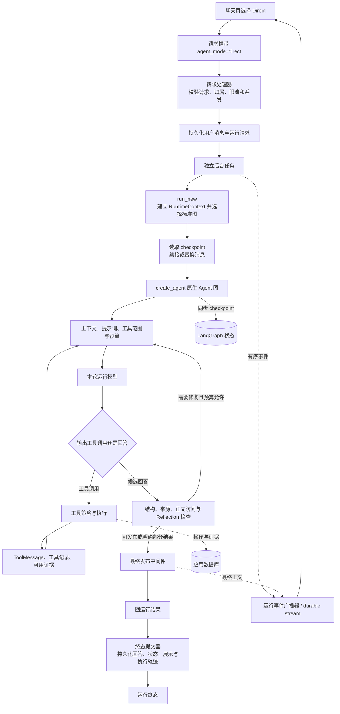
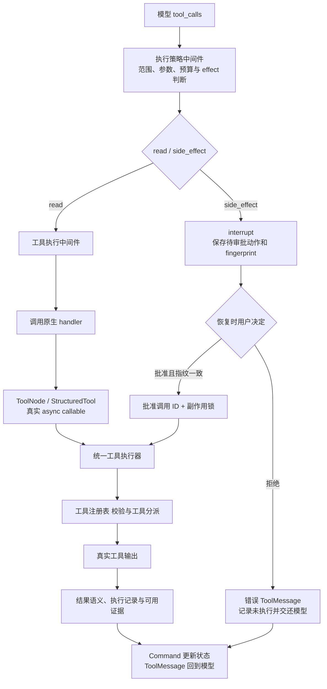
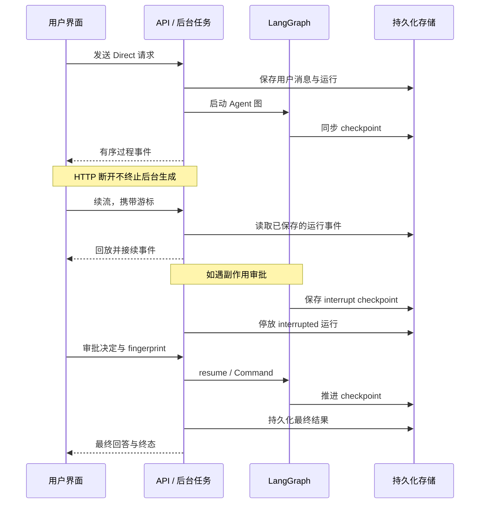

# Direct：可恢复、可核查的单 Agent 执行循环

## 1. 解决什么问题

Direct 让一个 Agent 根据用户请求决定是否调用工具、如何使用观察结果以及何时回答。它适合解释、查询和明确的操作，也能执行多轮工具调用。这里的“直接”表示不建立显式 Planning 步骤、不启动 Team 专家协作或 Goal 目标图，并不意味着只调用一次模型。

一种实现方式是使用 LangChain `create_agent` 编译原生 LangGraph 图，应用在中间件和执行器中实现权限、预算、证据和发布控制。框架负责模型/工具循环和独立工具调用的分发；应用负责允许做什么、如何执行，以及结果能否被发布。

## 2. 总体实现图

下面是职责图，箭头表示主要数据流；不是中间件 hook 的逐行执行顺序。



## 3. 从发送消息到进入 Direct

1. 前端发送本轮消息、会话标识、历史分支位置、执行模式和用户选定的知识库范围。
2. 请求入口检查大小、格式、身份、资源归属、限流和运行容量。
3. 服务端准备会话历史，原子领取运行。同一会话已有活跃运行时接续已有任务，避免重复启动。
4. 启动生成前保存用户消息；先建立首个事件订阅，再启动后台任务，避免刷新丢消息和漏掉首批事件。
5. 后台任务加载系统提示词，建立模型、执行器、事件桥和服务端权限上下文。
6. 显式选择 Direct 时进入标准 Agent 图，关闭计划协调，不启动专家协作或目标执行图。

Auto 选到 Direct 时最终进入同一标准图，但此前多一次产品路由，记录的请求模式仍是 Auto。核查时应同时看请求模式与实际模式。

## 4. 图、上下文和历史如何建立

以 LangChain 为例，图构建配置可以写成下面的示意代码。`runtime_model`、`tools` 和 Schema 由应用提供：

```python
create_agent(
    model=runtime_model,
    tools=tools,
    middleware=(...),
    state_schema=RuntimeState,
    context_schema=RuntimeContext,
    checkpointer=checkpointer,
    response_format=ToolStrategy(AnswerSchema),
)
```

占位模型用于建图；每轮调用前注入运行模型。模型网关负责调用治理，用量回调负责记录实际消耗。

`RuntimeContext 保存模型、注册表、执行器、事件桥、数据库、运行身份、知识库范围和副作用锁。RuntimeState` 保存消息、工具观察、证据、反馈、计数及终态。身份与授权范围来自服务端上下文，不能交给模型自由填写。

存在可续接 checkpoint 时，只补入最新一轮消息，并处理未闭合的历史工具调用。编辑问题、切换分支或重置历史时，明确替换输入，避免旧状态重复混入。

图调用可以使用 LangGraph 的消息与状态更新双流，并在推进前同步持久化 checkpoint。内部摘要输出应与用户正文隔离；历史保存和模型请求压缩也是两个不同职责。

## 5. 每一轮模型调用前后发生什么

中间件职责如下。每种 hook 的前后/包装调用顺序由框架决定，不能把此表当作固定流水线。

| 中间件 | 职责 | Direct 中是否生效 |
| --- | --- | --- |
| 会话记忆中间件 | 按上下文条件摘要历史，保留后续运行需要的消息 | 是 |
| 提示词与模型中间件 | 注入运行模型，组织系统指令、工具范围、证据目录和修复反馈 | 是 |
| `ContextEditingMiddleware` | 框架上下文编辑，使用近似 token 计数 | 是 |
| 上下文预算中间件 | 请求上下文预算控制 | 是 |
| 答案复核中间件 | 对候选答案执行复核，必要时形成修订反馈 | 是 |
| 执行策略中间件 | 调用策略、审批、预算和回答证据门禁 | 是 |
| 工具执行中间件 | 工具范围与参数处理、调用执行及结果/证据回写 | 是 |
| 最终发布中间件 | 图结束后发布最终正文与终态说明 | 是 |
| 规划协调 | 显式步骤与依赖管理 | Direct 不启用 |

模型拥有工具选择与观察解释能力；服务端拥有工具授权、参数校验、预算和发布决定。知识库检索是共享工具能力：模型决定是否调用 `search_knowledge_base`、怎么组织 query、是否需要补查，不是 Direct 入口固定执行的 RAG 前置步骤。

## 6. 工具调用的真实路径



### 只读工具

工具包装层检查授权范围并归一化参数，再调用框架原生工具处理器。工具适配器将真实调用交给统一执行器，执行器返回观察与证据记录。
因此，只读工具没有绕开 ToolNode；执行器也没有接管框架的 Agent 循环。独立只读调用可以由原生图分发，具体并发仍受应用资源限制。

统一工具执行器 校验模型参数，管理执行记录、资源占用、工具隔离、有限重试、熔断和符合条件的来源回退。工具结果经语义判定才进入证据集合，工具没有抛异常并不等于取得可引用证据。

### 有副作用的工具

策略层生成动作 fingerprint，包含运行、调用 ID、工具和参数，调用 LangGraph `interrupt。后台将运行停放为 interrupted` 并持久化待审批信息。

恢复时校验指纹。批准只登记该调用 ID，执行阶段在副作用锁内调用执行器；拒绝生成“未执行”的工具回执并交还模型。副作用应谨慎设置重试策略，并通过幂等键、操作日志或 outbox 管理重复执行风险；这些措施不等于对所有外部系统提供绝对 exactly-once 保证。

知识库检索应限制在用户授权范围内；用户限定来源时，工具执行门禁也要落实这一约束。不同工具的资源标识应保持类型与归属边界，不能混用。

## 7. 候选回答如何成为最终结果

1. 可配置响应格式为 `ToolStrategy(AnswerSchema)`。模型给出结构化候选回答，由服务端处理文本块、来源和展示引用。
2. 执行策略中间件 检查结构、引用与本轮可用证据，处理正文访问缺口及来源回退等反馈。答案复核中间件 补充候选答案复核。这些 hook 共同作用，不应简单理解成唯一固定的“先证据、再 Reflection”流水线。
3. 有缺口且修复预算允许时，将反馈投影到后续模型请求，让模型修订或补取证；达到限制时保留已有结果并明确缺口，不应强行标记成功。
4. 通用解释可以没有外部证据；已经读取外部证据后，不能用通用解释类型逃避来源检查。副作用结果是操作回执，不能当成只读事实证据。
5. 图结束发布钩子 取最终正文、处理来源展示、归一化状态和终态说明，然后调用事件桥发布最终回答。
6. runtime 返回 图运行结果。后台通过 终态提交器 整理最终消息、展示片段、工具记录、可用证据、claim-evidence、预算和运行轨迹，以 终态持久化 持久化终态，并完成广播生命周期。

`completed`、`partial`、`failed`、`cancelled`、`blocked 是终态；interrupted` 是等待审批的停放状态。结构化解析成功、工具调用成功、最终答案通过检查、终态落库成功属于不同证据，不能互相替代。证据门禁提高可追溯性，也不能保证模型语义判断绝对正确。

## 8. 三种恢复不能混为一谈



- **断线续流**：重新订阅已有运行事件；不重新调用模型。续流接口只处理订阅和游标。
- **审批恢复**：从 interrupt checkpoint 继续，并注入审批决定。
- **进程恢复**：后台恢复任务接续已有图状态；需要另行核查租约、尝试编号、取消与操作记录。

会话消息保存用户可见历史；checkpoint 保存图状态；运行事件保存回放游标；工具记录和证据保存执行事实。这些存储职责相关，但不能只靠聊天文字重建全部执行状态。

## 9. 按职责核查实现

| 边界 | 核查重点 |
| --- | --- |
| 请求入口 | 请求大小、身份、知识库归属、限流与运行容量在模型调用前检查 |
| 后台生命周期 | 用户消息先保存；先订阅再生成；断线不重复启动任务 |
| 图运行时 | Direct 禁用规划；状态续接与消息替换具有明确语义 |
| 模型调用 | 上下文、可见工具、证据目录与修复反馈一起构成本轮请求 |
| 工具适配 | 原生工具调用进入统一执行器，观察与证据回写到状态 |
| 审批 | 决定绑定具体动作和参数；拒绝时生成未执行回执 |
| 回答检查 | 来源存在、证据可用、缺口明确、修复预算有限 |
| 终态提交 | 回答、运行状态、展示片段和执行轨迹一致落库 |

## 10. 后续核查场景

| 场景 | 应观察什么 |
| --- | --- |
| 普通概念解释 | Direct、规划未启用；无工具也可回答 |
| 单个或多个只读查询 | 工具调用、执行记录、ToolMessage 与证据对应 |
| 选择知识库 | 服务端范围固定；检索由模型决策；来源可追溯 |
| 错误或缺失来源 | 补查和修订受预算限制；仍缺失时明确部分完成 |
| 副作用批准或拒绝 | 中断、指纹校验、批准后执行；拒绝不执行 |
| 刷新或网络断开 | 同一运行续流，不重复启动模型，最终消息仍落库 |
| 取消或进程重启 | checkpoint、运行状态与资源释放保持一致 |

核查时显式选择 Direct，分别验证模型行为、界面展示和持久化恢复。此表用于设计验收，不代表运行验证已经完成。

## 11. 可复用的设计与边界

可复用的是四个清晰接口：`RuntimeState 管运行数据，RuntimeContext 管服务端依赖与权限，统一工具执行器` 管真实执行，终态发布器管可见结果与落库。业务工具通过注册表适配为框架原生工具；新增工具应继承统一参数、范围、effect、证据和错误契约。

保留框架原生循环，把治理放在中间件中；将工具观察与可引用证据区分；将生成任务与 HTTP 订阅分离；将审批绑定到具体动作与参数；将回答生成和终态提交分成可核查边界。这些设计可以迁移到其他工具型助手。

业务工具、来源规则、模型网关和数据库方法属于适配层，复用时需要替换。Direct 没有显式依赖步骤或专家职责，复杂多领域任务的可解释编排应交给 Plan/Team；Goal 的完成条件循环也不能仅靠给 Direct 增加提示词来等同实现。

## 12. 框架参考

- [LangChain Agents](https://docs.langchain.com/oss/python/langchain/agents)：原生 Agent 循环、工具和中间件的基础机制。
- [LangGraph Interrupts](https://docs.langchain.com/oss/python/langgraph/interrupts)：checkpoint 上的中断与恢复机制。

官方文档解释框架机制，本文整理可复用的实现职责和流程。具体模型供应商、业务工具及存储适配应按使用场景选择。
