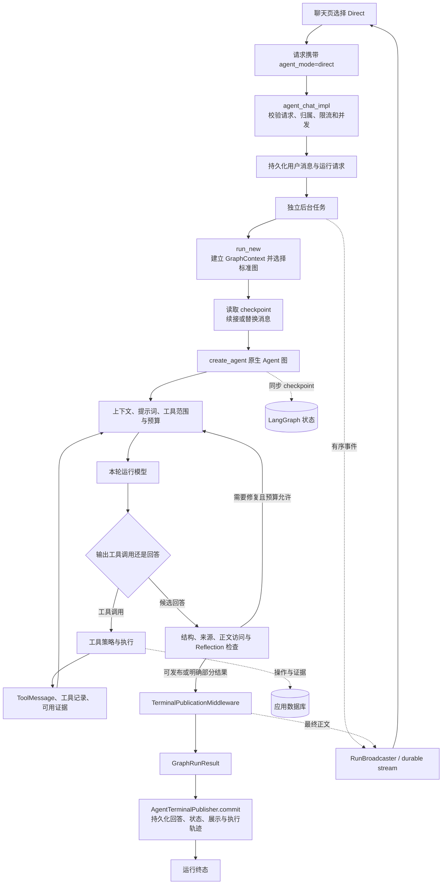
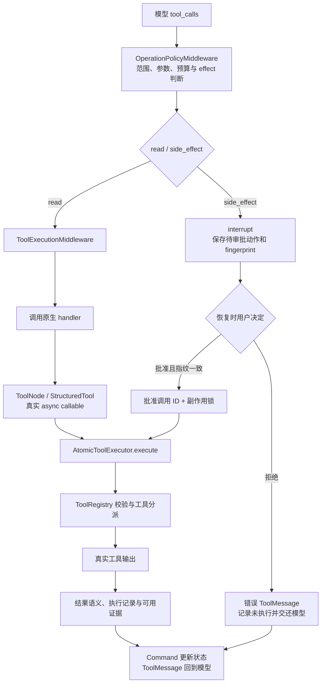
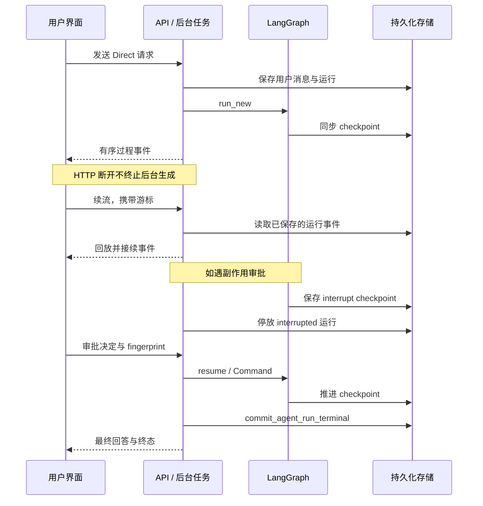

# Direct：可恢复、可核查的单 Agent 执行循环

> 分析日期：2026-10-07。来源项目：`qzruncode/Stock-Signal-Desk`（本地目录 `daily_stock_analysis`）。源码基线：`681bb8d44a50a262b8e3d196ca8d8943a55df3d1`，分析时工作区干净。
> 本文是当前实现的静态调用链说明；没有运行真实模型会话、审批操作或故障恢复实验。文中核查场景是后续验收清单，不表示已经通过。

## 1. 解决什么问题

Direct 让一个 Agent 根据用户请求决定是否调用工具、如何使用观察结果以及何时回答。它适合解释、查询和明确的操作，也能执行多轮工具调用。这里的“直接”表示不建立显式 Planning 步骤、不启动 Team 专家协作或 Goal 目标图，并不意味着只调用一次模型。

项目使用 LangChain `create_agent` 编译原生 LangGraph 图，应用在中间件和执行器中实现权限、预算、证据和发布控制。框架负责模型/工具循环和独立工具调用的分发；项目负责允许做什么、如何执行，以及结果能否被发布。

## 2. 总体实现图

下面是职责图，箭头表示主要数据流；不是中间件 hook 的逐行执行顺序。



## 3. 从发送消息到进入 Direct

1. `useChatController` 从当前聊天导出本次用户请求，发送 `conversation_id`、`messages`、`history_mode=server`、`history_parent_id`、`agent_mode` 和 `knowledge_base_ids`；当前界面还请求 `stream_presentation=timeline`。
2. `POST /agent/chat` 转交 `agent_chat_impl`。入口限制请求大小、解析 JSON、校验消息和会话参数，并校验所选知识库归属。请求限流与运行容量检查在执行模型前完成。
3. 服务端准备会话历史，在会话转换锁内原子领取运行。同一对话已有活跃运行时返回 409，前端按已有运行续流，避免重复启动。
4. 用户消息快照在启动后台生成前保存，避免用户刚发送就刷新时丢失本次问题。首连接先订阅广播，再启动后台任务。
5. `_execute_background_agent_run` 加载活动系统提示词、记录模型与提示词版本等运行元信息，然后调用 `agent_graph_runtime.run_new`。
6. `run_new(agent_mode="direct")` 直接选择标准图，不调用 Auto 路由模型。状态中 `resolved_agent_mode="direct"`、`planning_mode="direct"`、`planning_enabled=False`、`orchestrator_mode="direct_agent_loop"`。

Auto 选到 Direct 时最终进入同一标准图，但此前多一次产品路由，记录的请求模式仍是 Auto。核查时应同时看请求模式与实际模式。

## 4. 图、上下文和历史如何建立

`build_agent_graph` 的关键配置是：

```python
create_agent(
    model=_RuntimeModelPlaceholder(),
    tools=build_langchain_tools(registry),
    middleware=(...),
    state_schema=AgentState,
    context_schema=GraphContext,
    checkpointer=checkpointer,
    response_format=ToolStrategy(StructuredAgentAnswer),
)
```

占位模型用于建图；每轮模型调用由 `AgentPromptMiddleware` 注入 `context.model`。当前 `_context` 默认构造的是 `GuardedModelGateway` + `GuardedAnthropicChatModel`，并挂载持久化用量回调。不要把历史版本中的模型适配器名称当作当前实现。

`GraphContext` 保存模型、注册表、执行器、事件桥、数据库、运行身份、知识库范围和副作用锁。`AgentState` 保存消息、工具观察、证据、反馈、计数及终态。身份与授权范围来自服务端上下文，不能交给模型自由填写。

有已有 checkpoint 且本轮不是 `replace/branch/reset` 时，运行续接 checkpoint，只补入最新一轮消息并清理未闭合的历史调用。替换历史时使用 `Overwrite`。`history_mode=server` 先由会话服务整理历史，再由后台转换为续接语义；编辑消息会触发替换路径。

`_invoke_graph` 使用 `astream(stream_mode=["messages", "updates"], version="v2", durability="sync")`。状态在图推进过程中同步 checkpoint；消息流和状态更新分别处理，摘要模型的内部输出不会混进用户正文。

## 5. 每一轮模型调用前后发生什么

中间件按 `graph.py` 注册如下。每种 hook 的前后/包装调用顺序由框架决定，不能把此表当作固定流水线。

| 中间件 | 当前职责 | Direct 中是否生效 |
| --- | --- | --- |
| `ConversationMemoryMiddleware` | 按上下文条件摘要历史，保留后续运行需要的消息 | 是 |
| `AgentPromptMiddleware` | 注入运行模型，组织系统指令、工具范围、证据目录和修复反馈 | 是 |
| `ContextEditingMiddleware` | 框架上下文编辑，使用近似 token 计数 | 是 |
| `ContextBudgetMiddleware` | 请求上下文预算控制 | 是 |
| `ReflectionMiddleware` | 对候选答案执行复核，必要时形成修订反馈 | 是 |
| `OperationPolicyMiddleware` | 调用策略、审批、预算和回答证据门禁 | 是 |
| `ToolExecutionMiddleware` | 工具范围与参数处理、调用执行及结果/证据回写 | 是 |
| `TerminalPublicationMiddleware` | 图结束后发布最终正文与终态说明 | 是 |
| `PlanningCoordinatorMiddleware` | Plan 的计划与步骤协调 | 已注册，但 Direct 不启用规划 |

模型拥有工具选择与观察解释能力；服务端拥有工具授权、参数校验、预算和发布决定。知识库检索是共享工具能力：模型决定是否调用 `search_knowledge_base`、怎么组织 query、是否需要补查，不是 Direct 入口固定执行的 RAG 前置步骤。

## 6. 工具调用的真实路径



### 只读工具

`ToolExecutionMiddleware.awrap_tool_call` 先检查注册工具与授权范围、归一化参数，在 `native_tool_context` 中调用原生 `handler`。原生工具适配器 `_native_tool_coroutine` 再调用 `context.executor.execute(action, approved=False)`。

因此，只读工具没有绕开 ToolNode；执行器也没有接管框架的 Agent 循环。独立只读调用可以由原生图分发，具体并发仍受应用资源限制。

`AtomicToolExecutor` 校验模型参数，管理执行记录、资源占用、工具隔离、有限重试、熔断和符合条件的来源回退。工具结果经语义判定才进入证据集合，工具没有抛异常并不等于取得可引用证据。

### 有副作用的工具

策略层生成动作 fingerprint，包含运行、调用 ID、工具和参数，调用 LangGraph `interrupt`。后台将运行停放为 `interrupted` 并持久化待审批信息。

恢复时校验指纹。批准只登记该调用 ID，执行阶段在副作用锁内调用执行器；拒绝生成“未执行”的工具回执并交还模型。副作用自动执行尝试数为一次，执行器使用 outbox 等记录管理操作状态。这里的“一次尝试”不等于对所有外部系统提供绝对 exactly-once 保证。

`search_knowledge_base` 没有用户选择的范围时会被拒绝；用户明确限定只依据所选 PDF 时，其他工具也会被执行门禁阻止。PDF 知识库 document ID 不应冒充本地文本文件 ID 交给文件读取工具。

## 7. 候选回答如何成为最终结果

1. 默认响应格式为 `ToolStrategy(StructuredAgentAnswer)`。模型给出结构化候选回答，由服务端处理文本块、来源和展示引用。
2. `OperationPolicyMiddleware` 检查结构、引用与本轮可用证据，处理正文访问缺口及来源回退等反馈。`ReflectionMiddleware` 补充候选答案复核。这些 hook 共同作用，不应简单理解成唯一固定的“先证据、再 Reflection”流水线。
3. 有缺口且修复预算允许时，将反馈投影到后续模型请求，让模型修订或补取证；达到限制时保留已有结果并明确缺口，不应强行标记成功。
4. 通用解释可以没有外部证据；已经读取外部证据后，不能用通用解释类型逃避来源检查。副作用结果是操作回执，不能当成只读事实证据。
5. `TerminalPublicationMiddleware.aafter_agent` 取最终正文、处理来源展示、归一化状态和终态说明，然后调用事件桥发布最终回答。
6. runtime 返回 `GraphRunResult`。后台通过 `AgentTerminalPublisher.commit` 整理最终消息、展示片段、工具记录、可用证据、claim-evidence、预算和运行轨迹，以 `commit_agent_run_terminal` 持久化终态，并完成广播生命周期。

`completed`、`partial`、`failed`、`cancelled`、`blocked` 是终态；`interrupted` 是等待审批的停放状态。结构化解析成功、工具调用成功、最终答案通过检查、终态落库成功属于不同证据，不能互相替代。证据门禁提高可追溯性，也不能保证模型语义判断绝对正确。

## 8. 三种恢复不能混为一谈



- **断线续流**：重新订阅已有运行事件；不重新调用模型。入口的 `resume_existing` 和 `/agent/chat/resume` 属于这一类。
- **审批恢复**：`runtime.resume` 从 interrupt checkpoint 继续，并注入审批决定。
- **进程恢复**：后台 recovery 分支调用 `runtime.recover`，恢复已有图状态；需要另行核查租约、尝试编号、取消与操作记录。

会话消息保存用户可见历史；checkpoint 保存图状态；运行事件保存回放游标；工具记录和证据保存执行事实。这些存储职责相关，但不能只靠聊天文字重建全部执行状态。

## 9. 源码核查索引

以下链接固定到分析基线。实现变更后，应先更新基线，再核对这些符号和本文流程。源码属于来源项目，不在本笔记仓库内。

| 职责 | 源码入口 |
| --- | --- |
| 前端请求组装 | [apps/dsa-web/src/hooks/useChatController.ts:411](https://github.com/qzruncode/Stock-Signal-Desk/blob/681bb8d44a50a262b8e3d196ca8d8943a55df3d1/apps/dsa-web/src/hooks/useChatController.ts#L411) |
| 请求校验、运行领取与后台启动 | [api/v1/endpoints/agent/chat_route_start.py:47](https://github.com/qzruncode/Stock-Signal-Desk/blob/681bb8d44a50a262b8e3d196ca8d8943a55df3d1/api/v1/endpoints/agent/chat_route_start.py#L47) |
| 后台生命周期 | [api/v1/endpoints/agent/chat_background_runner.py:116](https://github.com/qzruncode/Stock-Signal-Desk/blob/681bb8d44a50a262b8e3d196ca8d8943a55df3d1/api/v1/endpoints/agent/chat_background_runner.py#L116) |
| 模式、历史与状态初始化 | [src/agent/langgraph_runtime/runtime.py:1460](https://github.com/qzruncode/Stock-Signal-Desk/blob/681bb8d44a50a262b8e3d196ca8d8943a55df3d1/src/agent/langgraph_runtime/runtime.py#L1460) |
| 运行模型与执行器构造 | [src/agent/langgraph_runtime/runtime.py:934](https://github.com/qzruncode/Stock-Signal-Desk/blob/681bb8d44a50a262b8e3d196ca8d8943a55df3d1/src/agent/langgraph_runtime/runtime.py#L934) |
| 原生流与同步 checkpoint | [src/agent/langgraph_runtime/runtime.py:1054](https://github.com/qzruncode/Stock-Signal-Desk/blob/681bb8d44a50a262b8e3d196ca8d8943a55df3d1/src/agent/langgraph_runtime/runtime.py#L1054) |
| 基础图与中间件注册 | [src/agent/langgraph_runtime/graph.py:63](https://github.com/qzruncode/Stock-Signal-Desk/blob/681bb8d44a50a262b8e3d196ca8d8943a55df3d1/src/agent/langgraph_runtime/graph.py#L63) |
| 提示词、模型与工具范围 | [src/agent/langgraph_runtime/middleware.py:1188](https://github.com/qzruncode/Stock-Signal-Desk/blob/681bb8d44a50a262b8e3d196ca8d8943a55df3d1/src/agent/langgraph_runtime/middleware.py#L1188) |
| 执行策略与回答门禁 | [src/agent/langgraph_runtime/middleware.py:2385](https://github.com/qzruncode/Stock-Signal-Desk/blob/681bb8d44a50a262b8e3d196ca8d8943a55df3d1/src/agent/langgraph_runtime/middleware.py#L2385) |
| 答案复核 | [src/agent/langgraph_runtime/middleware.py:1891](https://github.com/qzruncode/Stock-Signal-Desk/blob/681bb8d44a50a262b8e3d196ca8d8943a55df3d1/src/agent/langgraph_runtime/middleware.py#L1891) |
| 原生工具处理与副作用执行 | [src/agent/langgraph_runtime/middleware.py:4029](https://github.com/qzruncode/Stock-Signal-Desk/blob/681bb8d44a50a262b8e3d196ca8d8943a55df3d1/src/agent/langgraph_runtime/middleware.py#L4029) |
| 原生工具适配器 | [src/agent/langgraph_runtime/agent_tools.py:61](https://github.com/qzruncode/Stock-Signal-Desk/blob/681bb8d44a50a262b8e3d196ca8d8943a55df3d1/src/agent/langgraph_runtime/agent_tools.py#L61) |
| 真实执行治理 | [src/agent/langgraph_runtime/executor.py:201](https://github.com/qzruncode/Stock-Signal-Desk/blob/681bb8d44a50a262b8e3d196ca8d8943a55df3d1/src/agent/langgraph_runtime/executor.py#L201) |
| 模型主导的知识库检索 | [src/agent/langgraph_runtime/knowledge_research.py:98](https://github.com/qzruncode/Stock-Signal-Desk/blob/681bb8d44a50a262b8e3d196ca8d8943a55df3d1/src/agent/langgraph_runtime/knowledge_research.py#L98) |
| 图内最终发布 | [src/agent/langgraph_runtime/middleware.py:4597](https://github.com/qzruncode/Stock-Signal-Desk/blob/681bb8d44a50a262b8e3d196ca8d8943a55df3d1/src/agent/langgraph_runtime/middleware.py#L4597) |
| 应用终态落库 | [src/agent/terminal_publisher.py:405](https://github.com/qzruncode/Stock-Signal-Desk/blob/681bb8d44a50a262b8e3d196ca8d8943a55df3d1/src/agent/terminal_publisher.py#L405) |

## 10. 后续核查场景

| 场景 | 应观察什么 | 定向测试入口 |
| --- | --- | --- |
| 普通概念解释 | Direct、规划未启用；无工具也可回答 | `test_agent_answer_contract.py` |
| 单个或多个只读查询 | 原生工具调用、执行器记录、ToolMessage 与证据对应 | `test_langgraph_agent_runtime.py`、`test_agent_tools.py` |
| 选择 PDF 知识库 | 服务端范围固定；检索由模型决策；来源与页码可追溯 | `test_agent_knowledge_evidence.py` |
| 错误或缺失来源 | 补查/修订受预算限制；仍缺失时结果明确 partial | `test_agent_claim_evidence.py`、`test_agent_answer_contract.py` |
| 副作用批准或拒绝 | interrupt、指纹校验、批准后执行；拒绝不执行 | `test_agent_resume.py`、`test_agent_runtime_safety.py` |
| 刷新或网络断开 | 相同 run_id，续流不重复启动模型，最终消息仍落库 | `test_agent_durable_runtime.py`、`test_agent_streaming_projection.py` |
| 取消或进程重启 | checkpoint、运行状态与资源释放保持一致 | `test_agent_recovery.py`、`test_agent_checkpoint_history.py` |

这些是测试文件索引，不表示其中每个测试都专门使用 Direct。执行核查时应选取相关用例，并显式传入 `agent_mode="direct"`，防止 Auto 路由影响判断。真实浏览器行为、真实模型行为、持久化恢复还需各自验收。

## 11. 可复用的设计与边界

可复用的是四个清晰接口：`AgentState` 管运行数据，`GraphContext` 管服务端依赖与权限，`AtomicToolExecutor` 管真实执行，终态发布器管可见结果与落库。业务工具通过注册表适配为框架原生工具；新增工具应继承统一参数、范围、effect、证据和错误契约。

保留框架原生循环，把治理放在中间件中；将工具观察与可引用证据区分；将生成任务与 HTTP 订阅分离；将审批绑定到具体动作与参数；将回答生成和终态提交分成可核查边界。这些设计可以迁移到其他工具型助手。

本项目的 stock 工具、PDF 来源规则、模型网关和数据库方法属于项目适配层，复用时需要替换。Direct 没有显式依赖步骤或专家职责，复杂多领域任务的可解释编排应交给 Plan/Team；Goal 的完成条件循环也不能仅靠给 Direct 增加提示词来等同实现。

## 12. 框架参考

- [LangChain Agents](https://docs.langchain.com/oss/python/langchain/agents)：原生 Agent 循环、工具和中间件的基础机制。
- [LangGraph Interrupts](https://docs.langchain.com/oss/python/langgraph/interrupts)：checkpoint 上的中断与恢复机制。

官方文档用于解释框架机制；本文项目行为以固定源码基线为准。仓库已有的 [PDF 知识库 RAG 笔记](../rag/design.md) 是另一份历史记录，其中关于固定前置检索的描述应重新对照当前 `knowledge_research.py` 核查，不应用它替代本次 Direct 调用链。
