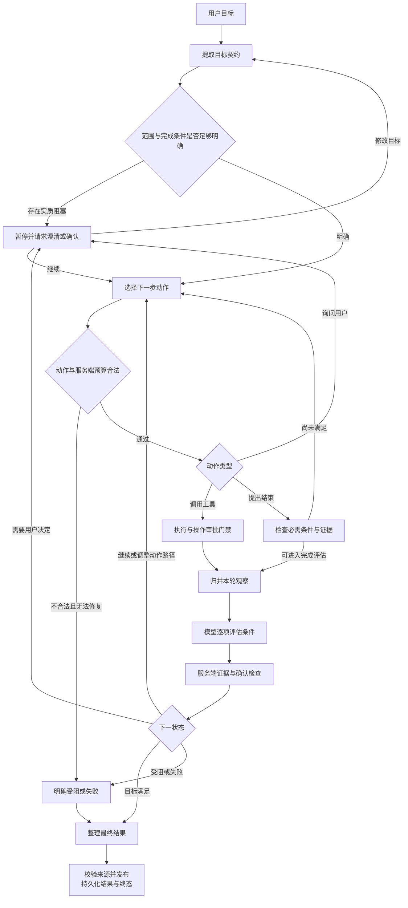
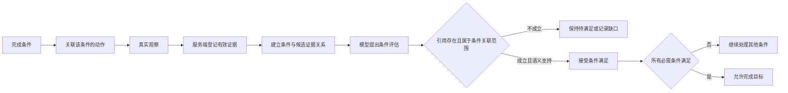
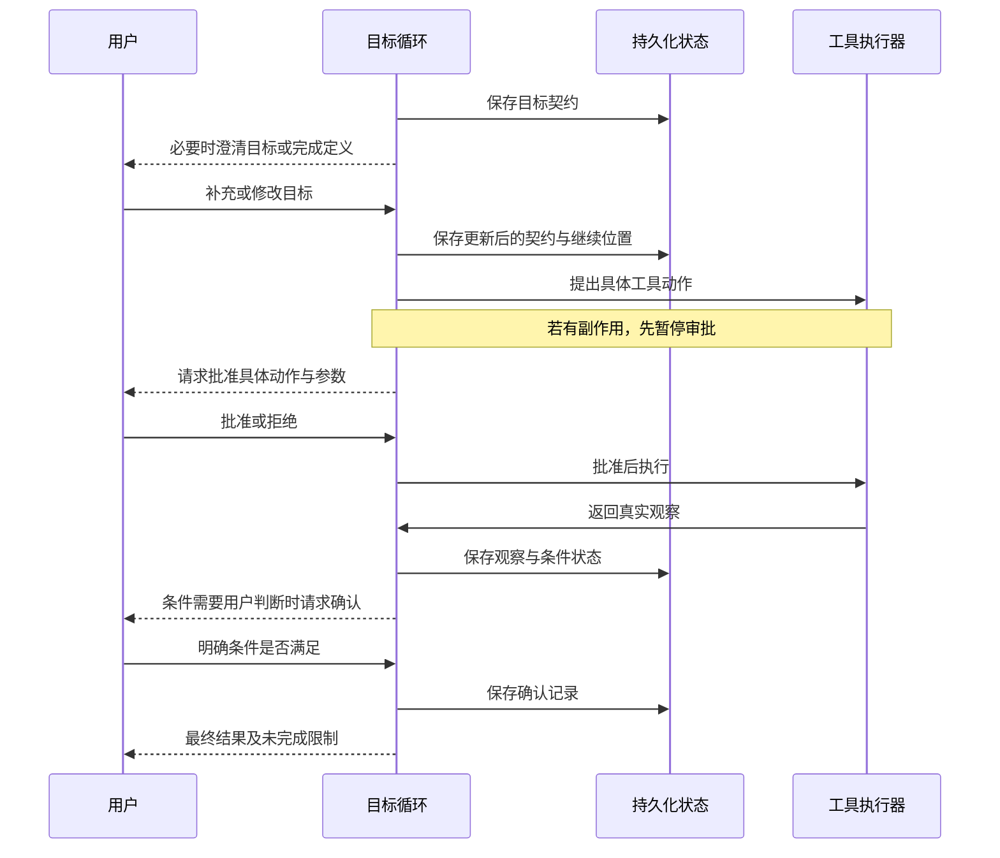

# Goal：围绕完成条件推进的目标执行循环

## 1. 解决什么问题

有些任务的结果明确，路径却需要边做边判断。例如寻找符合条件的资料：第一次检索可能发现信息不全，需要换查询、补查来源，或询问用户补充决定性条件。

Goal 将用户目标转成可核验的完成条件，再循环执行“选择动作 → 执行 → 观察 → 评估”。每次下一步由当前缺口决定，不要求一开始就列出完整步骤。

它与 [Plan](plan.md) 的区别在控制中心：Plan 围绕显式步骤与依赖推进，Goal 围绕目标条件与证据状态推进。它也不默认启动 [Team](team.md) 的专家分工。独立的目标图可以复用 [Direct](direct.md) 中的模型、工具、审批、证据与发布能力，但不必继承其业务流程。

## 2. 总体执行图

图描述职责和主要分支。动作成功、条件满足和最终结果发布是不同边界；任何一层都不能用模型的一句“已完成”替代。

## 3. 目标契约包含什么

| 内容 | 含义 | 作用 |
| --- | --- | --- |
| 目标 | 用户希望获得的结果 | 固定执行方向 |
| 范围 | 研究对象、资源与边界 | 避免无限扩展 |
| 约束 | 来源、权限和其他限制 | 限制所有后续动作 |
| 指标 | 衡量进度或结果的维度 | 帮助评估有效性 |
| 成功条件 | 可核查的完成定义 | 决定何时能结束 |
| 条件是否必需 | 必须完成或可选 | 避免被可选项无限拖延 |
| 验证方法 | 工具结果、运行检查、用户确认或模型评估 | 明确谁能证明完成 |
| 条件状态与依据 | 待满足、满足、失败或无法验证，以及证据关联 | 保存真实进度 |
| 升级处理方式 | 无法自动验证时怎么办 | 指导询问或停止 |
| 契约版本 | 用户修改后的目标定义 | 区分目标变化与路径调整 |

成功条件应来自用户实际目标。不要把通用免责声明、回答样式或额外分析章节编造成必需条件，也不要编造不可证明的标准。

需要用户澄清的，是会实质阻碍推进的信息缺口。非阻塞偏好可以使用合理默认值；已经明确的范围不应反复要求确认。

## 4. 动作与条件如何关联

每个动作应包含类型、标识、目标条件、具体工具与参数，以及选择理由。动作选择器接收目标契约、当前条件状态、已有证据、最近观察、上一轮反馈和允许工具目录。

| 动作类型 | 使用时机 | 服务端边界 |
| --- | --- | --- |
| 工具动作 | 能取得缺失观察或执行必要操作 | 工具注册、参数、资源归属、约束与预算检查 |
| 询问用户 | 缺失信息或用户决定无法由工具替代 | 暂停等待明确回答，不能边问边执行依赖动作 |
| 结束提案 | 已具备完成依据 | 检查必需条件，不能直接宣告成功 |

动作必须指向有效条件。模型不能用目录外工具，也不能为了满足目标突破用户限制。知识库检索由动作选择器决定是否执行及如何查询，授权范围仍由服务端提供。

一种实现方式是每次选择一个明确动作，再执行、观察与评估。一次动作不等于一次模型调用：目标提取、动作选择、进度评估和最终整理各自都可能消耗调用预算。

## 5. 文字执行流程

1. **提取契约。** 从请求和相关上下文中整理目标、约束与可验证条件。先明确要证明什么，再决定用哪个工具。
2. **处理必要确认。** 没有可用完成定义、验证方式不明或存在阻塞问题时暂停；目标足够明确时直接推进。
3. **检查剩余资源。** 执行前检查迭代、模型调用、工具调用和路径调整预算，由服务端决定还能否继续。
4. **选择动作。** 根据尚未满足的条件和最近观察选择工具、询问或结束提案，并标明动作与条件的关联。
5. **校验和执行。** 服务端验证动作与工具参数，执行来源与权限约束。副作用经过审批，再进入统一执行器。
6. **归并观察。** 保存真实结果、错误或操作回执，登记有效证据并关联到动作所针对的条件。
7. **评估条件。** 模型逐项提出满足、待补、失败或无法验证的判断，引用实际存在的证据；服务端再应用证据和用户确认门禁。
8. **决定继续方式。** 有缺口则继续或调整下一步路径；需要人决定则暂停；预算耗尽或无法可靠推进则停止并保留已取得的观察。
9. **整理与发布。** 根据实际条件状态输出结论、依据和限制，核对来源后保存最终状态。结束叙述不能把受阻目标包装成已完成。

## 6. 证据门禁如何避免虚假完成

服务端只接受本轮有效、已关联到相应条件的候选证据。模型不能随便选择一条存在的来源，就把无关条件标记成满足。

同一证据可以支持多个条件，只要关联与内容都有效。例如同一段可靠资料同时包含数值和时间，就不必为了两个条件重复取证。

需要用户确认的条件必须有明确用户确认记录，模型评估或工具结果不能替代用户决定。候选证据已经取得但暂时还不足时，应保留候选记录，供后续重新评估，而不是清空观察。

代码可验证引用存在、范围合法和记录完整；内容是否足以支持结论仍涉及语义判断。证据门禁不能保证模型判断绝对正确。

## 7. 调整路径不等于修改目标

Goal 的“重新规划”可以表现为监控器指出当前动作路径不合适，记录缺口并让下一次动作选择改用另一条路径；不要求重建一份完整步骤清单。

| 变化 | 是否改变目标契约 | 示例 |
| --- | --- | --- |
| 继续取证 | 否 | 当前资料不足，再查询一个可靠来源 |
| 调整动作路径 | 否 | 原查询无法得到关键字段，改用更合适的工具 |
| 请求补充信息 | 暂停处理 | 对象身份不明，询问用户 |
| 用户修改目标 | 是，需要重新提取与确认条件 | 改变范围或完成标准 |

路径调整不能放宽约束或降低标准来制造完成。用户修改目标后，旧证据是否还能适用，应重新检查范围、条件与时间，不能直接继承旧目标的成功状态。

目标修改、路径调整与来源回退应留下不同记录，便于核查为什么执行方向改变。

## 8. 三类用户交互不要混淆

- **目标澄清**：确定要做什么，以及怎样算完成。
- **条件确认**：确认无法由工具替代的用户判断。
- **操作审批**：允许某个有副作用的具体动作执行。

批准操作不代表确认目标完成，确认目标也不代表批准所有副作用。中断记录应绑定契约或动作标识与参数指纹，恢复时验证对应关系。拒绝和修改都应产生明确状态，不能被当成默许。

## 9. 预算、终止和最终回答

服务端分别控制迭代次数、路径调整次数、模型调用、工具调用和动作格式修复。模型不能自行提高上限。预算检查也要覆盖评估和最终整理，避免只限制工具却让内部推理调用无限增长。

目标可以在必需条件满足时完成；无法安全或可靠推进时受阻；契约、动作或评估无法可靠解析时失败。等待用户属于可恢复的暂停，不能误作完成或无限运行。

受阻时仍可输出已经取得的有用信息，但须说明尚未满足的条件。运行故障不证明资料不存在，也不能抹掉已经成功取得的观察。

最终整理优先使用已记录状态与有效证据。整理模型失败或没有剩余调用预算时，应使用诚实的状态回执，不凭空补写事实。最终事实引用要再次核对；目标条件通过，也不意味着任意新增结论都有依据。

## 10. 持久化与长期任务的边界

目标图应有独立的状态和 checkpoint 身份，保存契约、条件、当前动作、观察、证据、确认记录、预算与历史。这样审批恢复或进程恢复才能续接目标循环，避免与其他执行模式状态混淆。

事件回放服务于界面恢复，checkpoint 服务于执行恢复；用户看到的进度说明只是投影，不是重新构造状态的唯一来源。评估提案经服务端接受后才适合展示为进展，未经核验的完成断言不能直接流入正文。

一次有预算、可暂停恢复的目标循环，不自动等于长期后台任务。跨天持续研究、周期触发、外部事件唤醒和长期通知还需要持久任务生命周期、调度器与跨运行策略。不能仅因模式名叫 Goal，就声称具备这些能力。

## 11. 核查与复用清单

| 场景 | 应核查的行为 |
| --- | --- |
| 目标和范围明确 | 直接推进，不反复确认非阻塞偏好 |
| 完成定义缺失 | 暂停澄清，不编造完成标准 |
| 动作指向未知条件或非法工具 | 阻止执行或有限修复 |
| 工具成功但条件未满足 | 保留观察，继续处理缺口 |
| 无关或伪造证据 | 不接受条件满足 |
| 一个证据支持多个条件 | 合法复用关联，不无意义重复取证 |
| 用户确认型条件 | 等待用户，不用模型自评替代 |
| 模型提出结束但必需条件缺失 | 拒绝提前完成 |
| 路径调整或用户改目标 | 分开记录，不靠降低标准宣告成功 |
| 预算耗尽或评估失败 | 明确停止，保留已取得信息 |
| 中断与恢复 | 对齐契约、动作指纹、条件与执行位置 |
| 最终整理失败 | 输出已有状态，不编造结果 |

可复用的核心是“目标契约 → 条件关联动作 → 真实观察 → 条件证据门禁 → 受预算控制的反馈循环”。目标选择与进度判断使用模型，权限、执行、证据关联和终止边界由服务端治理。

Goal 更适合路径需要根据反馈变化的任务。简单查询用 Direct；步骤与依赖需要明确表达时用 Plan；跨领域专家分工与独立审查用 Team。四种方式共享基础能力，但拥有不同的控制中心。

## 12. 框架参考

- [LangGraph Graph API](https://docs.langchain.com/oss/python/langgraph/graph-api)：状态、条件边与循环编排机制。
- [LangGraph Interrupts](https://docs.langchain.com/oss/python/langgraph/interrupts)：通过 checkpoint 暂停并注入用户决定继续执行。

目标契约、条件证据关系、预算与完成门禁属于应用层设计，框架不会自动提供这些业务规则。本文核查清单用于后续验收，不代表已经完成真实运行验证。
