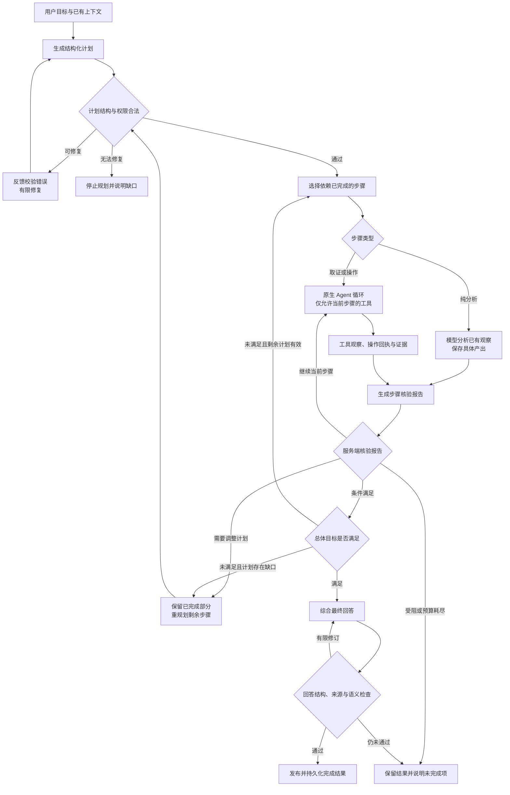
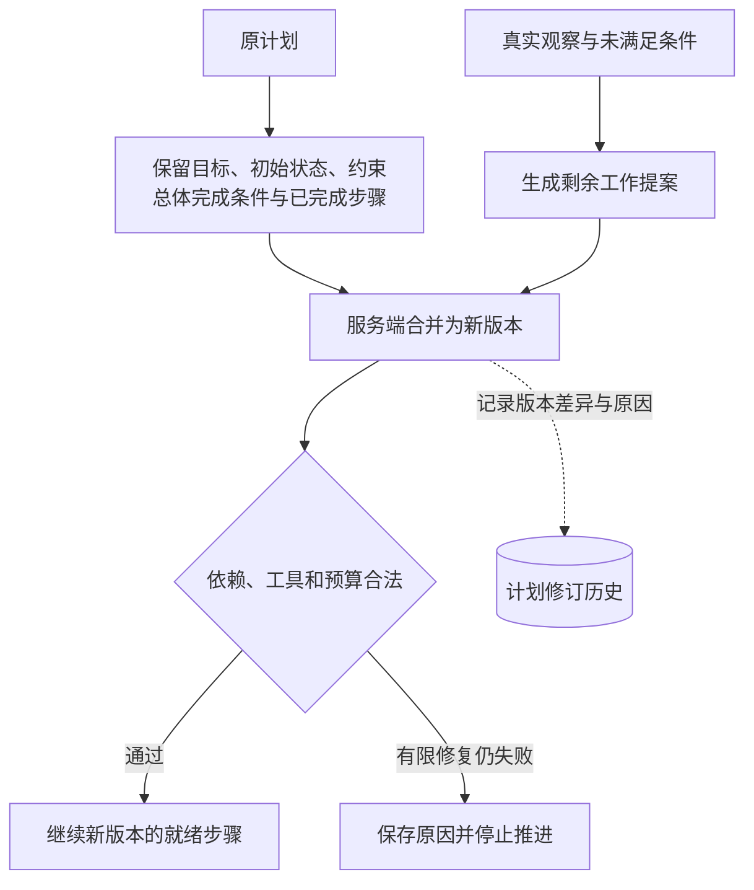

# Plan：按依赖执行、逐步核验与重规划

## 1. 解决什么问题

多步任务常有先后依赖：先确认对象，再取得资料，统一口径，最后比较。如果只在提示词里写“先列计划再执行”，计划容易变成一段文字，后续执行未必遵守它，也无法证明每一步是否完成。

Plan 将目标、步骤、依赖和完成条件变成结构化运行状态。模型负责提出计划、选择具体工具与评估观察；服务端校验计划、决定哪些步骤可以推进，并控制权限和预算。它适合需要明确步骤、可追踪进度和失败后调整路径的任务。

Plan 可以沿用 [Direct 的原生 Agent 循环](direct.md)，通过协调中间件增加计划控制。规划器、执行者和评估者是不同职责，可以使用同一模型，不意味着启动多个并行 Agent。

## 2. 总体流程图

下面描述逻辑流程，不表示框架中间件 hook 的固定调用顺序。

“继续当前步骤”主要用于需要补充观察的执行步骤。纯分析步骤同样需要实际模型产出，不能靠切换状态跳过；分析不足时应明确调整或受阻。

## 3. 一份可执行计划包含什么

| 层级 | 字段含义 | 为什么需要 |
| --- | --- | --- |
| 总体目标 | 用户要达成的结果 | 防止只完成步骤而偏离原问题 |
| 初始状态 | 已知事实、上下文和起点 | 区分已知输入与待取得观察 |
| 约束 | 来源、权限、范围和其他限制 | 重规划时也必须遵守 |
| 总体完成条件 | 可以开始最终综合的事实与分析前提 | 判断整体是否具备回答条件 |
| 计划版本 | 当前修订版本 | 追踪计划为什么改变 |
| 步骤标识与依赖 | 哪些前置步骤完成后才可执行 | 避免顺序混乱与循环依赖 |
| 步骤类型 | 工具执行或纯分析 | 明确是否授予工具权限 |
| 步骤目标与输入 | 本步要建立什么、使用什么 | 限制执行上下文 |
| 允许工具 | 本步可用的注册工具集合 | 约束实际执行能力 |
| 预期观察与完成条件 | 应取得什么、何时算完成 | 为核验提供依据 |
| 步骤状态 | 待执行、执行中、完成或受阻 | 支持调度、展示和恢复 |

总体完成条件应描述“资料和分析是否足以回答”，而不是“最终 Markdown 是否已经写好”。最终综合与发布属于后续阶段，不应混入取证步骤，造成执行中提前输出最终答案。

### 示例：比较两个方案

这是流程示例，工具名称和数据均为示意。

图中 B、C 表示彼此没有依赖，并不自动意味着两个专家并行执行。Plan 可以按就绪顺序逐步处理；单个步骤内的独立工具调用仍可由基础 Agent 图分发。需要领域专家分工与协作时属于 Team 的职责。

## 4. 文字执行流程

1. **进入计划路径。** 显式选择 Plan 后，开启计划协调；Auto 选择 Plan 时，先完成产品路由再进入这条路径。执行过程中不因一次失败就静默切换为无计划执行。
2. **生成计划。** 规划请求包含用户目标、相关上下文、约束和精简工具目录。目录提供工具名称、用途与操作类型，避免把全部参数 Schema 都塞进规划提示词；真实执行阶段再绑定完整工具参数。
3. **校验计划。** 服务端检查结构、标识、依赖、工具权限和预算。非法计划进入有限修复；仍失败时停止。
4. **选择就绪步骤。** 服务端选择前置依赖全部完成的待执行步骤，记录当前步骤、计划版本和尝试次数。
5. **执行当前步骤。** 模型接收本步目标、输入、完成条件和已有观察。执行步骤仅暴露允许的工具；工具实际执行也使用同一权限边界。纯分析步骤不给工具权限，但仍实际调用模型并保存分析产出。
6. **取得并归属观察。** 工具输出与当前步骤、调用标识建立关联。成功回执、可用事实证据和失败信息分别处理，不能把工具未报错等同于步骤完成。
7. **评估并校验。** 模型生成步骤报告，服务端检查条件覆盖、引用有效性和实际执行情况，再决定继续、完成、重规划或受阻。
8. **检查总体目标。** 每次步骤完成后确认原目标是否仍有缺口。所有步骤执行完但目标未满足时，应补规划或输出部分结果。
9. **最终综合与发布。** 具备回答条件后恢复最终回答协议，进入共享的来源、结构和语义检查。只有最终回答也通过检查，计划整体才能记为完成。

## 5. 校验器为什么不可省略

模型生成的结构化对象只是提案。Schema 能检查字段类型，但执行前还需要业务校验。

| 检查项 | 拒绝或处理方式 |
| --- | --- |
| 重复步骤标识、空目标或空完成条件 | 返回明确错误，要求修复 |
| 未知依赖、自依赖、循环依赖 | 阻止执行，不能随意猜一个顺序 |
| 不存在的工具 | 拒绝计划，不扩大注册工具权限 |
| 执行步骤没有工具、分析步骤却带工具 | 拒绝类型与权限不一致的步骤 |
| 超过步骤预算 | 缩减或重写计划，不能由模型提高上限 |
| 来源受限却没有对应取证步骤 | 要求计划落实来源约束 |
| 在取证前安排空泛的“准备分析” | 可将其条件并入目标检查，避免无观察的额外轮次 |

校验器拥有推进权。模型可以建议“完成”，但不能直接把依赖节点标记为已完成，也不能通过修改目标来制造成功。

## 6. 步骤报告：观察之后才谈完成

步骤报告至少要回答：观察到了什么、预期观察是否取得、每项条件是否满足、依据来自哪里、剩余计划是否有效，以及整体目标还有什么缺口。

| 评估结果 | 含义 | 后续动作 |
| --- | --- | --- |
| 完成 | 当前步骤条件已有观察支持 | 服务端核验后推进 |
| 继续 | 当前执行步骤仍需补查 | 携带缺口反馈，再调用允许的工具 |
| 重规划 | 现有路径无法解决观察暴露的问题 | 修改剩余步骤 |
| 受阻 | 权限、来源、条件或预算使任务无法继续 | 保存已有结果，说明阻塞 |

完成条件可由服务端编号，评估报告只引用编号；来源也通过服务端目录中的编号引用，再映射到真实证据。这样可以校验编号是否存在、是否可用及是否属于本次范围，减少模型复制长标识带来的错误。

结构和引用可由代码检查；证据是否充分支持结论仍含模型语义判断。引用有效不等于结论必然正确。

没有新观察、只有“我已经完成”一类自然语言时，不应推进取证步骤。可以允许短暂的过程说明，但连续无进展必须受预算限制，最终触发调整或受阻。

## 7. 重规划保留什么、改变什么

重规划不是从头再做。已完成事实由服务端保留，模型只能提出剩余工作的替代方案。新的依赖要在合并后的计划中有效，不能指向已被删除的未完成步骤。

重规划也不能降低原完成条件、修改约束或把未完成项从目标里删掉。需要改变用户目标时，应显式处理新的用户指令。

若现有证据已经满足总体目标，可以省去剩余冗余的只读步骤；这不应成为跳过用户明确要求的操作或审批的理由。

## 8. 预算与失败边界

预算应由服务端配置，而非规划模型填写。需要同时限制总步骤数、重规划次数、单步补查轮次、无进展轮次、结构化对象修复次数，以及共享模型和工具消耗。具体阈值按任务成本和容错要求设置。

不同故障属于不同边界：计划格式错误需要修复提案；来源不足需要补查；工具暂时失败交给共享执行治理；依赖路径失效需要重规划；权限拒绝不能靠换工具绕过。

共享工具恢复尚在处理一个失败时，计划协调应等待观察归并，避免同时对同一失败再做评估与重规划。预算耗尽后输出已完成部分、未满足条件及原因，不能无声退回任意工具调用。

## 9. 持久化、恢复与展示

持久化状态应包含计划与版本、当前步骤、步骤状态、观察关联、核验报告、修订原因和预算计数。Checkpoint 保存图的继续位置，运行事件保存用户可回放的进度，两者职责不同。

审批仍复用基础执行器的中断机制。恢复后继续原步骤，并核验具体动作与参数；审批拒绝是本步观察的一部分，不应把步骤强行记为成功。HTTP 断线只是订阅变化，不应重新生成一份计划。

执行模型请求可以只携带当前步骤、目标、相关观察与核验反馈，减少其他步骤和旧回答协议的干扰；完整记录保留在持久化状态中。历史对话可提供上下文，但不自动变成本轮核验过的证据。

界面展示计划摘要、实际进展和最终结果；完整条件、证据与版本差异可放在运行详情。内部规划/评估模型的原始输出应与用户正文隔离，过程说明不能冒充最终回答。

## 10. 核查与复用清单

| 场景 | 应核查的行为 |
| --- | --- |
| 多步任务 | 计划包含目标、条件与有效依赖，执行顺序受控 |
| 非法依赖或未知工具 | 有限修复或停止，不放宽权限 |
| 工具成功但条件不足 | 保持当前步骤，补查或调整 |
| 纯分析步骤 | 有具体模型产出，无工具权限 |
| 全部步骤完成但目标不足 | 重规划或明确部分完成 |
| 重规划 | 保留原目标与完成事实，只替换剩余工作 |
| 连续无进展或预算耗尽 | 停止推进，保留已取得观察 |
| 最终回答校验失败 | 计划不能宣告整体完成 |
| 刷新、审批或进程恢复 | 续接原状态，不重复建计划或重复副作用 |

可复用的核心是“计划契约 → 依赖调度 → 受限执行 → 观察报告 → 服务端核验 → 有限重规划”。规划协调应组合已有 Agent、工具、审批、证据与发布能力，避免再建立一套执行器。

Plan 的代价是额外规划和评估调用。简单解释与单个明确查询通常适合 Direct；跨领域专家协作适合 Team；围绕高层完成标准动态选择动作则更接近 Goal。

## 11. 框架参考

- [LangChain Middleware](https://docs.langchain.com/oss/python/langchain/middleware/overview)：在原生 Agent 图内通过 hook 控制提示词、工具与终止逻辑。
- [LangGraph Persistence](https://docs.langchain.com/oss/python/langgraph/persistence)：图状态的 checkpoint 与中断恢复基础。

本文的计划契约、步骤核验和重规划属于应用层设计，不能因为使用框架中间件就认为框架会自动提供这些业务规则。核查清单用于后续验收，不代表已经完成真实运行验证。
