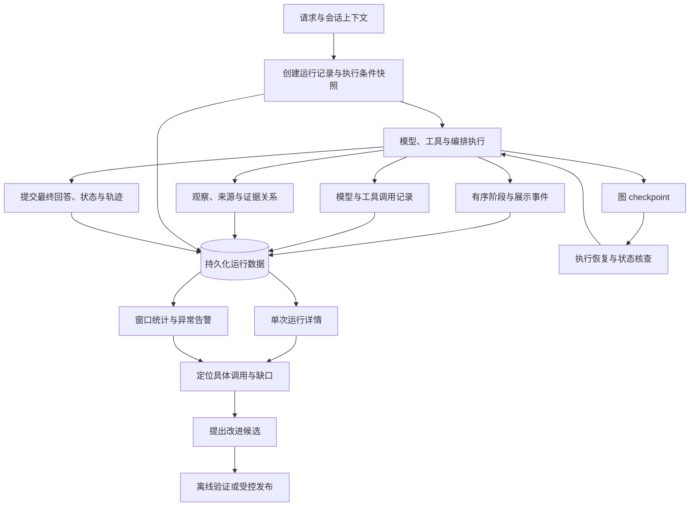
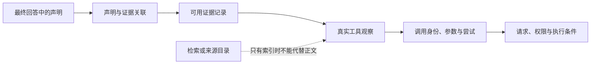
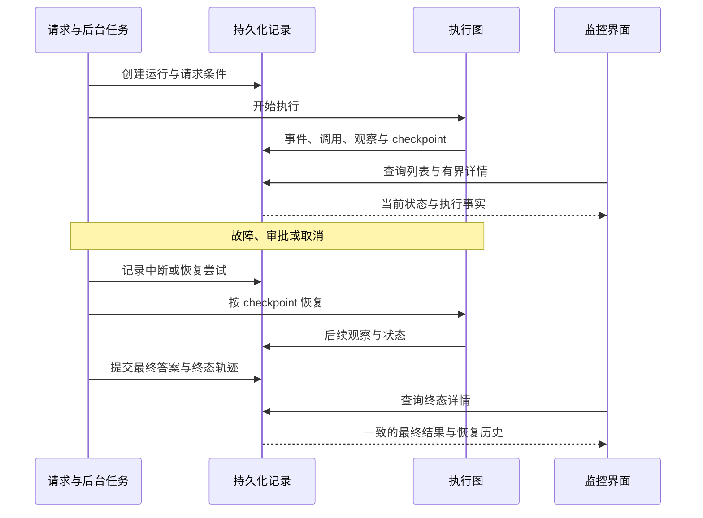

# Agent 运行记录与监控：让概率执行可追溯、可定位、可改进

## 1. 为什么它是必要能力

Agent 的模型决策具有概率性。同一问题可能产生不同的工具选择、参数、取证路径和结论；外部数据、工具响应、上下文与模型版本也会改变结果。只保存最终聊天文字，无法解释一次结果如何形成，更难定位偶发错误。

运行记录应回答：当时收到什么请求、使用什么执行条件、实际做了哪些动作、取得哪些观察、如何引用证据、哪里失败或恢复，以及最终向用户发布了什么。监控则将这些事实汇总成可发现异常、可下钻定位的视图。

记录不会消除概率性，但能让变化和失败有迹可查。它应与执行引擎一起设计，而不是出问题后才补打印日志。

## 2. 从运行到监控的架构

运行日志、checkpoint 与监控投影承担不同职责。Checkpoint 用于继续执行；有序事件用于还原过程与续流；调用记录保存真实执行；最终轨迹将一次运行整理为可查询结果。

## 3. 分层记录，避免只留一个大 JSON

| 记录层 | 应保存什么 | 用途 |
| --- | --- | --- |
| 运行主记录 | 身份、请求、模式、状态、时间、尝试与资源统计 | 列表查询、生命周期与容量治理 |
| 执行条件快照 | 模型配置、提示词版本、工具目录、预算、代码与依赖版本 | 理解结果形成时的环境 |
| 有序事件 | 阶段、动作身份、序号、状态变化与展示片段 | 时间线、断线回放和恢复核查 |
| 调用明细 | 工具、参数、模型请求与回执、耗时、错误、重试与幂等复用 | 定位具体执行问题 |
| 观察与证据 | 实际内容、来源、数据时间、可用性及引用关联 | 核对事实依据 |
| 终态快照 | 发布答案、执行轨迹、展示投影、未完成项 | 详情查询与历史恢复 |
| 资源与控制记录 | 租约、熔断、审批、取消与恢复 | 定位卡住、重复执行和权限问题 |

这些记录通过运行、调用、任务、尝试和父子关系关联。完整载荷可以按需读取，主列表和默认详情使用有界摘要，避免大请求或长工具结果拖慢界面。

## 4. 概率决策也需要执行条件

记录输入之外，还应保存足以比较运行差异的条件：请求模式与实际模式、模型及采样参数、上下文规模、提示词标识与摘要、工具目录版本、知识范围、预算和执行版本。

逻辑请求指纹可以排除随机消息 ID 与传输时间，用于寻找相似任务；但相同指纹不代表相同执行环境，更不保证输出一致。

版本与哈希帮助发现变化，不等于完整复现能力。模型供应商实现、外部网页和数据源可能变化；严格复现还需要保存允许保留的输入与观察快照。重新运行真实工具可能产生副作用，不能把“查看回放”与“重新执行”混为一谈。

## 5. 单次运行怎样看

详情应从用户最关心的结果开始，再允许逐层展开，而不是先展示大量内部日志。

1. **最终结果与终态。** 展示用户得到的回答、实际执行模式、时间和明确限制。
2. **问题入口。** 区分运行故障、工具故障、证据缺口、条件未满足和诊断提示；定位到对应详情。
3. **执行过程。** 展示模型轮次、任务依赖、专家分工、审批、重试与恢复。
4. **工具观察。** 对照调用参数、真实回执、错误码和数据时间，必要时加载完整载荷。
5. **证据与结论。** 查看答案声明引用了什么，来源是否被实际读取、是否具备支持内容。
6. **资源消耗。** 展示模型与工具调用、报告的 token、估算消耗、耗时和预算使用。
7. **条件与版本。** 查看当时的提示词、工具能力和运行设置，供差异比较。

[会话展示投影](conversation-projection.md) 服务于自然的用户对话，运行详情服务于执行核查。两者使用关联记录，但不能把全部详情塞进聊天正文。

## 6. 从结论追到实际观察

有链接不等于读取过正文，读取过不等于内容支持结论，工具成功也不等于证据充分。监控应保留这些区别，否则“来源数很多”可能只是记录了很多候选链接。

应区分事实、模型推断和无法核验的内容。声明与证据关系可以支持人工核查，规则检查或模型评估仍然只是检查结果，不能当成真实性保证。

来源抽样可重新访问部分来源，观察可达性和正文片段。但重新访问看到的是抽样时状态，不能覆盖或伪装成当时的原始观察。应记录抽样时间、范围、失败与限制。

## 7. 四种执行模式需要不同记录

| 模式 | 特有的核查内容 |
| --- | --- |
| Direct | 模型轮次、工具选择、观察、修复反馈与最终发布 |
| Plan | 计划版本、步骤依赖、核验报告、重规划原因与总体缺口 |
| Team | 专家与任务身份、并行交接、失败策略、审查、冲突及定向补做 |
| Goal | 目标契约、条件状态、动作关联、用户确认、路径调整与终止理由 |

通用主记录不应硬编码领域，例如将所有任务限定为某个行业。业务差异放在工具能力和结果契约里，记录层统一保存身份、动作、观察与状态。

## 8. 执行状态、质量判断与用户反馈

| 信号 | 能说明什么 | 不能证明什么 |
| --- | --- | --- |
| 运行完成 | 按运行协议达到完成状态 | 答案一定正确 |
| 工具成功 | 调用在执行层成功返回 | 数据完整、及时或可用于结论 |
| 证据检查通过 | 引用与检查项满足定义的规则 | 语义绝对可靠 |
| 行为诊断 | 检测到重复调用、缺口或异常模式 | 所有提示都需要阻止运行 |
| 用户反馈 | 用户认为结果是否有帮助 | 客观事实已经验证 |
| 外部评价 | 某套标准下的判断或分数 | 适用于全部任务的正确率 |

事实记录应先保存，再生成诊断、规则检查或评价投影。保存检查标准与版本，区分需要处理的问题和仅供观察的提示，不让一个总分掩盖具体证据缺口。

工具先失败后通过重试成功时，既要保留失败事实，也要展示恢复结果。同一故障可能出现在事件、调用记录和工具结果中，详情计数应按调用或错误身份归并，避免重复计算。

## 9. 全局监控看什么

| 维度 | 指标与问题 |
| --- | --- |
| 生命周期 | 排队、运行、等待审批、恢复中和终态数量 |
| 服务水平 | 明确时间窗口内的完成比例、耗时分位数和规划耗时 |
| 工作负载 | 事件、模型调用、工具调用、token 和估算费用 |
| 恢复 | 恢复尝试、恢复后终态、成功比例与幂等复用 |
| 资源治理 | 活跃与过期租约、资源占用、运行容量 |
| 熔断 | 打开、半开和过期熔断状态 |
| 依赖就绪 | 数据库、执行图、checkpoint 与模型配置是否可用 |

成功率需要说明分子、分母、窗口和终态口径；不能用一个成功率代替答案正确率。耗时分位数应说明是否包含等待审批或排队。Token 估算与供应商报告用量分开显示，缺少报告不等于消耗为零。

浅层就绪检查与真实依赖探测分开。真实模型探测有延迟和成本，可以按需执行并缓存；一个可选业务来源失效，不应自动判定整个通用 Agent 不可用。

指标发现趋势，单次轨迹定位原因。告警应能下钻到受影响运行，避免只有一个红色总数却找不到对应执行。

## 10. 状态一致性与恢复核查

进程内状态不能成为唯一依据。运行租约、尝试编号与持久化事件用于判断谁拥有执行权、是否过期，以及恢复是否重复推进。

运行主记录、图状态和用户可见结果有不同写入边界。终态提交失败、取消竞态和恢复中断都需要明确处理，避免数据库显示完成而图仍运行，或界面一直等待已结束任务。

记录系统自身也需要监控：写入失败、事件游标停滞、遗漏终态和详情截断都会影响可信度。无记录不能被当成“没有问题”。

## 11. 安全与保留策略

只记录与定位问题有关的事实，不把密钥、认证头或隐私内容作为普通配置快照保存。请求与工具参数在采集、存储及展示边界进行脱敏；敏感载荷按权限读取，必要时采用加密与审计。

运行详情按租户与所有者授权，不能只凭运行 ID 读取。完整载荷按需加载，前端折叠不等于服务端权限控制。

保留策略应区分生命周期摘要、错误记录、完整载荷与事件历史。限制长度时标明截断，保留身份、状态和错误关联。供应商若提供推理摘要，也不应将其当成完整隐藏思维过程记录或展示。

## 12. 如何形成改进闭环

从重复失败或高消耗运行定位具体问题，再提出提示词、工具契约、预算或流程候选。使用脱敏案例进行离线比较，必要时受控发布，并比较新旧版本的实际表现。

不要因为一次模型诊断就让 Agent 在线修改自己的代码、提示词或全局权限。概率系统需要可审核的变更与独立验证，否则监控可能变成新的不受控决策来源。

| 核查场景 | 应验证的行为 |
| --- | --- |
| 完成但结论可疑 | 能追到声明、证据与实际观察 |
| 工具失败后恢复 | 保留失败与恢复，不重复统计同一故障 |
| 重试、审批、取消和重启 | 身份、尝试、资源和终态一致 |
| 供应商不报告用量 | 明确未知与估算，不能显示为零消耗 |
| 长运行与大载荷 | 摘要有界、完整详情按需，关键状态不丢失 |
| 权限或脱敏检查 | 不跨归属读取，不暴露凭据 |
| 指标告警 | 口径明确，能定位具体运行 |
| 记录写入故障 | 可被发现，不将记录缺失误作成功 |

## 13. 参考

- [LangSmith Observability](https://docs.langchain.com/langsmith/observability)：从单次轨迹到整体性能监控的分层思路。
- [OpenTelemetry Traces](https://opentelemetry.io/docs/concepts/signals/traces/)：通过跨度、父子关系和事件关联执行过程。

可以借鉴成熟观测体系的关联方式，在已有运行、事件、调用与轨迹记录上扩展，不必为了监控另建一套业务执行日志。本文整理机制与核查方法，不表示本次完成了真实运行或告警验收。
