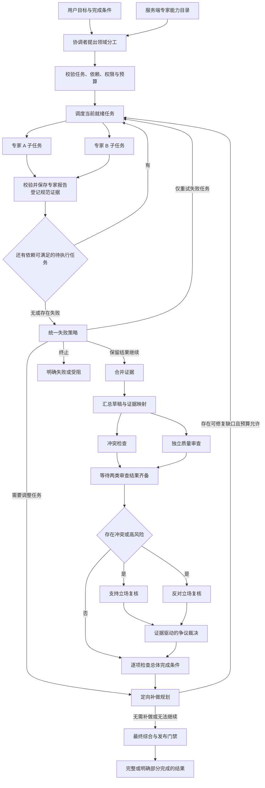
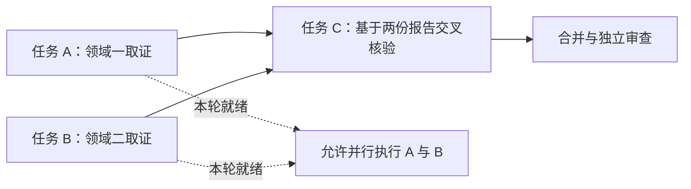
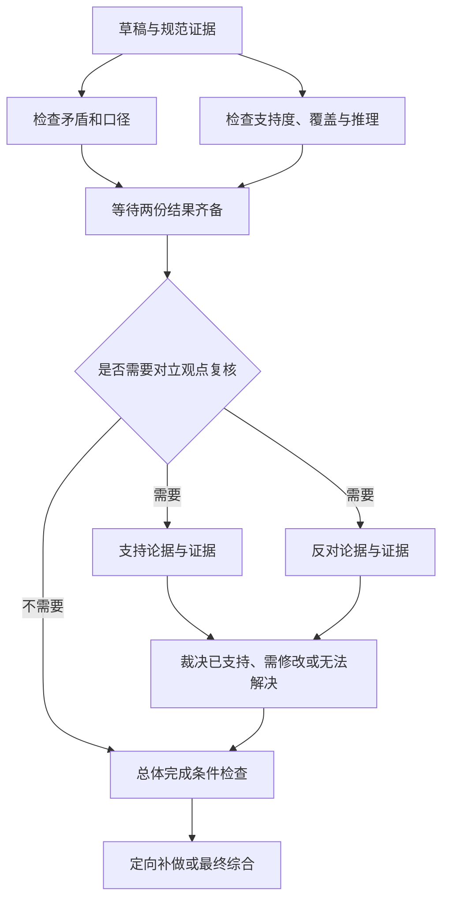

# Team：专家分工、证据交接与协作审查

## 1. 解决什么问题

复杂任务可能同时涉及多个领域。让一个模型在同一上下文里处理所有资料，容易遗漏某个方向、混淆不同口径，或直接把互相矛盾的观察拼成结论。

Team 将任务分成有明确职责的专家工作，再通过统一交接、证据合并和独立审查形成最终结果。它适合多个方向确实可以独立研究、同时又需要综合判断的任务。专家可以使用同一基础模型，区别在于任务、上下文、工具权限和输出契约。

与 [Plan](plan.md) 围绕步骤推进不同，Team 围绕专家任务与交接协议组织执行。专家内部可以复用 [Direct](direct.md) 的模型与工具循环；Team 本身需要独立的协作图，不能只把单 Agent 的提示词改成“扮演多个角色”。

## 2. 总体协作图

这是职责与主路径图，具体失败分支还需要检查任务状态和依赖。正常完成的任务也经过失败策略边界，确认没有遗失、未完成或受阻任务后再进入汇总。

## 3. 注册专家不等于启动专家

专家目录由服务端维护，描述身份、能力、可用工具、输入输出约定和执行策略。协调者只能从目录中选择本轮需要的专家，不能临时编造身份或给专家授予目录外权限。

| 专家定义 | 用途 |
| --- | --- |
| 稳定身份与领域能力 | 说明谁负责哪类问题 |
| 工具范围 | 限制专家能取得哪些观察 |
| 输入与输出契约 | 约束接收的任务和回传的报告 |
| 图节点与命名空间 | 区分执行、事件和恢复位置 |
| 并发与资源策略 | 防止多个专家无限消耗共享资源 |
| 重试与恢复策略 | 定义失败时允许采取的动作 |

只有任务实际选中了专家，专家才进入执行。新增注册专家不会自动加入每一次运行。领域任务应有实质分工，避免两个专家重复回答完全相同的问题，只增加成本。

一种适合研究助手的边界是让专家仅使用只读工具。需要产生外部副作用的操作应通过单独的执行与审批边界处理，不能因为“专家需要”就扩大权限。

## 4. 从分工提案到可执行任务

协调者提出精简的分工提案：总体目标、完成条件、专家选择、子任务目标、依赖、输入引用、成功条件和分工理由。工具提示只表达优先使用哪项已有能力，不授予新权限。

服务端再将提案编译成可执行任务，补齐工具范围、图节点、资源预算和执行策略，并校验依赖与成功条件。这样模型负责研究分工，服务端负责执行权限。

| 任务内容 | 核查重点 |
| --- | --- |
| 任务标识与专家身份 | 标识唯一，专家确实已注册 |
| 子目标与成功条件 | 有可核验的产出，能够服务总体目标 |
| 前置依赖与输入引用 | 无环、无未知依赖，输入来源可追溯 |
| 工具权限 | 在该专家的服务端能力范围内 |
| 调用预算与尝试次数 | 不突破共享运行和专家策略 |
| 失败处理方式 | 重试、调整、部分结果或终止具有明确语义 |

任务数、专家数、并发数和模型调用次数是不同概念。一个专家可以承担多个任务，但每次调用仍需独立任务身份和上下文。

## 5. 依赖调度与并行执行

1. 调度器检查任务是否已有结果、是否已分发，以及前置任务是否完成。
2. 仅分发本轮就绪任务。A、B 无依赖时可并行；C 要等两者完成并交接后才能执行。
3. 每个专家接收自己的任务、允许工具、必要上下文和依赖报告。不要将所有专家的完整消息历史复制给每个子任务。
4. 专家通过原生 Agent 子图取证，使用共享模型治理、工具执行和来源约束。
5. 并行输出写入各自结果或审查通道，再按任务标识合并。不能让多个分支无控制地覆盖同一字段。
6. 交接后重新调度。前置任务失败时，后续任务不能假装依赖已满足，而应进入失败策略处理。

LangGraph 的 `Send` 可用于按运行状态动态分发专家调用，节点负责独立执行，状态合并规则负责归并结果。并发规模仍应受服务端策略限制。

## 6. 交接报告与规范证据目录

专家的自然语言回答不能直接成为团队最终结论。交接应保存结构化报告，包含任务与专家身份、完成状态、观察、结论、限制、证据引用、成功条件检查和执行尝试。

证据登记层给本轮实际取得的有效来源建立规范标识。后续草稿、审查、争议裁决和最终综合都引用这一目录，避免专家各自编号造成错引，也避免把重复来源当成多份独立支持。

| 对象 | 含义 | 不能替代什么 |
| --- | --- | --- |
| 工具记录 | 调用了什么、结果如何 | 不自动证明事实成立 |
| 可用证据 | 真实来源及可引用内容 | 不自动证明专家结论正确 |
| 专家报告 | 对证据的领域解释及限制 | 不直接等于团队共识 |
| 草稿 | 对专家产出的综合提案 | 尚未通过独立审查 |
| 最终结果 | 通过门禁或明确标注缺口的发布内容 | 不能隐藏失败和未决冲突 |

模型可通过临时的来源编号引用证据，服务端负责解析到规范记录并检查可用性。不能仅因为一个引用字符串格式正确，就认为来源存在。

## 7. 失败重试与审查补做

两种再执行的触发原因不同，不能合并成“有问题就全体再跑一次”。

| 策略 | 触发与行为 |
| --- | --- |
| 失败重试 | 当前任务失败且仍有尝试预算，只重试该任务 |
| 调整任务 | 失败说明原路径需要改变，将缺口交给补做规划 |
| 保留部分结果 | 保留有效证据，明确未完成任务，继续有边界的汇总 |
| 终止 | 无法继续时结束团队运行并记录原因 |
| 审查补做 | 独立审查将具体证据或结论缺口映射到相关任务，定向补充 |

失败重试不能重跑已经成功的兄弟任务。成功状态也不意味着永远不能补做：如果审查明确指出该任务的证据存在缺口，可以带着具体修复指令重新打开它，并保留之前有效的观察。

“部分完成”是明确的失败策略，不能为了追求完整而无限重试。任务尝试次数、补做轮次和共享预算共同决定还能否继续。

## 8. 为什么需要两类独立审查

草稿形成后，并行执行冲突检查与质量审查。前者检查专家之间的矛盾、实体和时间口径；后者检查证据是否支撑结论、任务是否覆盖目标，以及是否存在遗漏或过度断言。

汇合节点必须等两类审查到达终态，再决定后续路径；不能由先返回的审查者根据半份结果推进。

存在冲突、高风险或明确复核要求时，再引入支持与反对立场。两方使用同一规范证据目录，裁决依据是证据与完成条件，不是投票或折中措辞。无法解决的冲突应保留不确定性。

没有冲突也必须检查总体完成条件。多个专家意见一致，可能只是共同遗漏了同一个问题。

## 9. 定向补做与最终综合

补做规划综合失败记录、审查意见、未决冲突和完成条件，将缺口映射到可修复的任务。明确需要补充什么、由谁完成、使用哪些已有证据，以及是否还有执行预算。

补做结果重新进入证据合并、草稿和审查链。已经裁决解决的冲突属于历史记录，不能反复当成新的补做指令。尝试或轮次耗尽后，形成明确的部分结果或受阻说明。

最终综合只能使用有效报告与规范证据，不应启动任意领域工具绕过专家任务。共享的回答结构、来源、语义与发布检查仍然需要执行。任务返回、审查通过和最终发布成功是三个不同的边界。

## 10. 持久化、身份与恢复

团队根状态保存任务计划、分发记录、尝试次数、报告、证据目录、审查结果、补做决定和终态。子任务拥有独立节点身份、上下文和命名空间，即使底层执行函数相同，也不能在事件中混成一个专家。

专家子图可以采用每次调用独立的状态生命周期，并继承父图 checkpoint。以 LangGraph 为例，子图的 `checkpointer=None` 表达这种调用级持久化方式，并不意味着父图没有持久化。独立专家通常不需要跨任务复用全部私有历史。

恢复时需要对齐父图位置、任务身份、尝试与交接记录，避免重复执行已交接任务。模型故障、工具失败、取消和执行策略触发的超时都必须留下状态；不能让父团队永久保持运行中。预算、工具期限、资源租约与模型请求期限是不同政策，不能用一个超时字段概括全部治理。

用户界面应展示领域分工、实际回传、缺口与最终结果。审查内部结构化输出和专家原始消息应经过展示投影，保留身份与事件顺序，避免所有并行输出混进正文。

## 11. 核查与复用清单

| 场景 | 应核查的行为 |
| --- | --- |
| 新增注册专家 | 未被选中时不自动执行 |
| 分工与工具权限 | 专家有效、任务有意义、权限不由模型扩大 |
| 依赖任务 | 仅当前就绪任务执行，失败依赖不会被绕过 |
| 一个专家失败 | 单独处理失败任务，成功兄弟结果保留 |
| 证据交接 | 后续各阶段引用同一规范目录，不伪造或错配来源 |
| 审查先后返回 | 等两类审查齐备后再路由 |
| 存在冲突 | 对立立场复核后依据证据裁决，未决冲突明确保留 |
| 无冲突但目标缺项 | 完成条件检查仍能发现缺口 |
| 审查要求补做 | 只打开有具体修复理由的任务，保留已有观察 |
| 预算耗尽或运行取消 | 发布明确状态并释放资源，不无限重跑 |
| 刷新或进程恢复 | 任务、事件和交接位置一致，不重复启动整队 |

可复用的结构是“服务端专家目录 → 分工提案 → 依赖调度 → 独立子任务 → 规范交接 → 并行审查 → 条件检查 → 定向补做 → 最终综合”。具体领域、工具和角色名称属于适配层。

Team 的成本包括更多模型调用、证据交接和审查延迟。多个角色并不会自动提高准确率；如果分工没有独立价值、引用无法归并或审查只是重复总结，就可能增加成本而没有增加可信度。简单查询适合 Direct，明确的单线步骤适合 Plan。

## 12. 框架参考

- [LangGraph Graph API](https://docs.langchain.com/oss/python/langgraph/graph-api)：状态、节点、边、动态分发与结果合并机制。
- [LangGraph Subgraphs](https://docs.langchain.com/oss/python/langgraph/use-subgraphs)：子图组合、状态隔离与持久化方式。

专家注册、证据目录、审查协议和失败策略属于应用层设计；框架提供编排机制，不会自动完成这些业务校验。本文核查清单用于后续验收，不表示已经完成真实运行验证。
