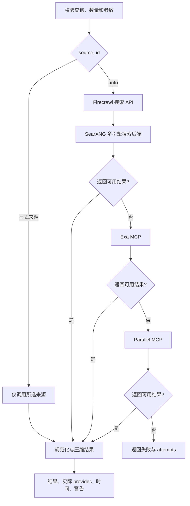
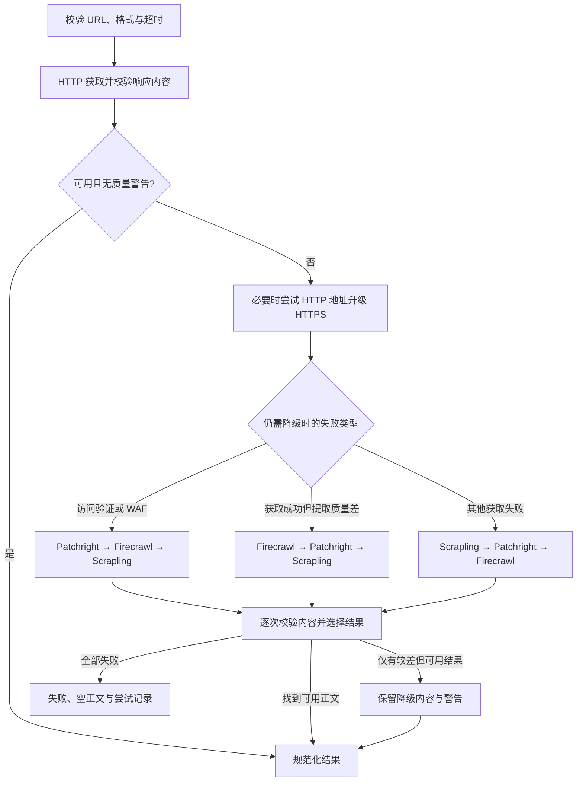

# Agent 网页搜索与读取：从候选链接到可核验正文

`search_web_source` 负责发现候选来源，`read_web_source` 负责读取指定来源。这两个工具把开放网络的检索与内容获取拆开，让 Agent 能按问题选择来源、核对原文，并保留失败和降级记录。

本文用图和文字说明一套具体实现及可复用的设计。参数、顺序和阈值属于该实现的工程选择，不是组件的通用默认值。核查清单用于后续验收，不表示已经逐项完成真实网络测试。

## 1. 为什么拆成两个工具

搜索结果通常只有标题、URL、摘要和可能存在的发布日期。摘要可能被截断，也可能来自搜索索引的旧版本。读取工具获取目标页面或文档正文，才能核对上下文、时间、限定条件和表格口径。

文字流程：先用实体、主题和时间生成查询；检查候选是否相关、是否来自合适的发布者；读取能支撑关键事实的 URL；检查实际返回的是正文、访问验证、附件还是部分内容；证据不足时补读其他来源；证据覆盖问题后停止检索。

已经知道准确 URL 时可以直接读取。结构化数据工具已经覆盖问题时，不必额外搜索网页。网页中的指令属于外部内容，不能改变工具权限或会话规则。

## 2. 职责与组件

| 层次 | 组件 | 职责 |
| --- | --- | --- |
| 模型可见入口 | `search_web_source`、`read_web_source` | 提供明确参数、来源枚举和统一结果 |
| 搜索调度 | 自动搜索链、单来源搜索适配器 | 自动降级或固定来源诊断 |
| 搜索基础设施 | Firecrawl + SearXNG、Exa、Parallel | 搜索公开网页，返回候选 |
| 获取调度 | 自动 URL 读取器、单来源读取适配器 | 根据失败类型选择下一种获取方式 |
| 获取组件 | HTTPX、Scrapling、Patchright、Firecrawl | HTTP 获取、浏览器渲染或服务端抓取 |
| 内容提取 | BeautifulSoup、lxml、markdownify、Trafilatura、MarkItDown | 清理 HTML、提取正文、转换文档 |
| 结果规范 | 统一适配器 | 补充实际来源、尝试记录、内容时间、截断及访问状态 |

这些工具直接复用网页搜索和读取基础设施，不经过证券行情数据服务。搜索引擎、抓取器和正文提取器分别解决“发现地址”“拿到页面”“找到有用内容”，不能互相替代。

## 3. 搜索工具的参数

| 参数 | 默认值／范围 | 含义 |
| --- | --- | --- |
| `query` | 必填 | 查询原样交给来源，只清理首尾空白；不自动扩写主题 |
| `source_id` | `auto` | 可选 `auto`、`firecrawl_searxng`、`exa`、`parallel` |
| `num_results` | 8，范围 1–20 | 希望返回的候选数量 |
| `context_max_characters` | 12000，工具入口范围 1000–30000 | 搜索结果上下文预算；底层适配器还可能施加自己的上限 |
| `livecrawl` | `fallback` | Exa 参数，可选 `fallback` 或 `preferred` |
| `search_type` | `auto` | Exa 参数，可选 `auto`、`fast`、`deep` |

后两个参数不意味着所有来源都具备相同能力。统一工具可以暴露来源特定选项，但必须说明实际由哪个适配器使用。

### 3.1 自动搜索流程

1. 自动模式优先请求自托管 Firecrawl 的 `/v2/search` 接口，由其连接 SearXNG。具体搜索引擎由 SearXNG 部署配置决定，不能仅凭工具名断言使用 Google、Bing 或其他引擎。
2. 主来源失败、未配置或没有可用结果时，依次尝试 Exa、Parallel。
3. Exa 和 Parallel 通过 HTTP JSON-RPC `tools/call` 调用 MCP 端点；适配器解析 JSON 或 SSE 包装中的文本，再整理候选链接。
4. 获得可用结果后停止切换。这里是顺序故障切换，没有并行搜索后融合三家排名。
5. 结果按数量及字符预算压缩，附带实际来源和每次尝试。前置失败而后置成功时，失败信息保留为警告，不把最终结果判成失败。

显式指定来源只调用这一家；失败不会悄悄换来源。这使诊断结果有明确归属。

### 3.2 搜索结果的证据边界

工具入口没有暴露 `include_content`，自动搜索默认不请求正文。底层搜索函数虽然具备可选抓取能力，不能因此把这个工具默认视为全文读取器。远程来源可能返回一些内容片段，它们也不证明已完整核验目标文档。

主要结果包含 `results`、`result_count`、`output`、`provider`、`attempts`、`retrieved_at`、`data_time`、`fallback_used`、`freshness_unknown`、`_truncated`、`errors` 和 `warnings`。

自动搜索的 `data_time` 取候选中可解析发布日期的最大值；它不是所有结果的共同日期，也不证明每条结果都新鲜。自动搜索的过期标记使用普通查询 30 天、深度查询 365 天的启发式窗口，不能代替逐条判断。

## 4. 读取工具的参数

| 参数 | 默认值／范围 | 含义 |
| --- | --- | --- |
| `url` | 必填 | 完整公开 HTTP(S) 地址 |
| `source_id` | `auto` | 可选 `auto`、`http`、`scrapling`、`patchright`、`firecrawl` |
| `format` | `markdown` | 可选 Markdown、纯文本、HTML；HTML 也可能经过正文筛选，不保证是原始响应字节 |
| `timeout` | 默认 30 秒，范围 5–120 秒 | 传给读取器的超时参数，不能当成整条降级链的总耗时上限 |

`http` 用标准 HTTP 获取；`scrapling` 在这里使用 HTTP Fetcher，并不等于执行 JavaScript；`patchright` 启动无头 Chromium 渲染；`firecrawl` 通过 HTTPX 请求抓取服务的 `/v2/scrape`，指定输出格式并启用 `onlyMainContent`。浏览器依赖必须额外可用，安装 Python 包本身不保证 Chromium 已就绪。

### 4.1 自动读取流程

文字流程：先尝试成本较低的标准 HTTP；对响应做类型识别、正文提取和挑战页检测；没有合格内容时按失败类型安排后备读取器；每次尝试都做内容校验；找到合适正文后停止；只有较差但可用内容时保留警告；全部失败时明确返回失败。

这个顺序是动态策略，不能简化成固定的“HTTP → Scrapling → 浏览器 → Firecrawl”。显式指定读取器时不执行跨来源降级。

### 4.2 内容选择并非只看成功状态

- HTTP 200 可能只是验证码、Cloudflare 验证、加密 WAF 载荷或 JavaScript 空壳，必须检查正文。
- 质量警告结果可以暂存，继续尝试更好的提取方式。
- 后备结果虽然无警告，但长度不足先前候选的 40% 时，可能丢失大量内容，不立即替换。
- 浏览器渲染的看板可能天然包含导航和链接。实现允许保留至少 1500 字符的完整页面降级结果，避免文章提取器删掉关键状态。
- 长度和相似度只是工程启发式，不证明内容正确；短文也可能是完整有效来源。

## 5. 从响应到正文

### 5.1 HTML 正文提取

1. 用 BeautifulSoup 和 lxml 解析 DOM，读取标题、描述及可识别的时间元数据，删除脚本、样式等干扰节点。
2. 对 `article`、`main` 及内容相关节点做语义评分，结合标题与描述的相似度，降低评论、导航、推荐区域的权重。强语义候选优先使用。
3. 普通文本和 Markdown 格式可调用 Trafilatura，关闭评论、保留表格，并按格式保留链接和图片。
4. 提取结果不足 80 字符时不采用该候选。对可见文本至少 1500 字符的页面，若文章提取只保留不足 12%，继续保留其他内容候选，避免丢掉看板信息。
5. 再尝试语义节点，最后回退到页面主体。Markdown 转换使用 markdownify。

因此，抓取器拿到相同 HTML，不同提取策略仍可能给出不同正文。诊断时需要同时查看 `provider` 和 `extraction_method`。

### 5.2 文档、文本和图片

| 类型 | 处理方式 | 边界 |
| --- | --- | --- |
| PDF、Word、PPT、Excel | 按 URL、MIME、下载头识别后，用 MarkItDown 转换 | 空解析或二进制样式内容不能冒充正文；不保证扫描 PDF 已完成 OCR |
| JSON、XML、纯文本等 | 按编码解码和类型处理 | 成功读取仍需判断内容是否回答问题 |
| 图片及其他附件 | 返回附件信息和获取状态 | 附件获取成功不等于已经得到可引用文本或完成图像理解 |
| JavaScript 页面 | Patchright 渲染后取 DOM 和可见文本 | 有限等待不保证所有交互、滚动分页或延迟内容已经加载 |

## 6. 结果合同与可信边界

| 字段 | 核查作用 |
| --- | --- |
| `success` | 本次获取及内容校验是否成功，不等于事实正确 |
| `url`／`final_url` | 请求地址和重定向后的实际地址 |
| `provider`／`source` | 最终使用的读取器及来源定位 |
| `attempts`／`fallback_used` | 降级过程、耗时、错误和实际尝试 |
| `content`／`attachments` | 正文与附件分别表达 |
| `extraction_method` | 语义 DOM、Trafilatura、整页降级、文档转换等提取方式 |
| `partial`／`_truncated` | 部分覆盖、质量降级或内容截断 |
| `retrieved_at` | 抓取时间 |
| `data_time`／`content_time` | 来源明确提供的发布或更新时间；未知时保持为空 |
| `freshness_unknown` | 无法确定来源时间，不能据此声称是最新材料 |
| `content_access` | 表达正文访问情况，区分文本、附件及失败状态 |
| `errors`／`warnings` | 最终失败与成功后的诊断信息 |

读取适配器对正文施加 60000 字符上限，截断会反映在状态中。内容日期优先取元数据，再从正文开头查找明确标注的发布／更新时间，不把 URL 中的日期、任意正文日期或抓取时间当成发布日期。

## 7. 资源和访问控制

标准 HTTP 路径限制响应大小为 5 MiB，重定向最多 8 次，并检查跳转目标。URL 校验默认拒绝非 HTTP(S)、内嵌用户名密码、本机和多数内网／保留地址；实现存在受控环境开关及特定代理地址兼容规则。

Patchright 会校验导航请求，阻断图片、媒体和字体资源以减少成本；这不是全子资源网络沙箱。HTTP、浏览器和远程抓取服务的网络行为也不同，不能把某一路的限制自动推广到全部读取器。

两个工具均声明最多 2 次工具层尝试；工具执行层重试与工具内部多个来源尝试是不同层级。监控需要记录二者，避免重试叠加造成耗时和请求量膨胀。

搜索和读取是只读工具，但查询及 URL 会发送给实际使用的服务。自动搜索可能切换到外部 Exa 或 Parallel；自托管主来源不代表整条自动链都只在本机处理。

## 8. 复用时的实现顺序

1. 先定义搜索候选和正文读取两种结果合同，明确索引、正文、附件及失败的边界。
2. 做单来源适配器，保留实际来源、URL、耗时和错误；显式来源必须可独立诊断。
3. 在同一套适配器上增加自动调度，按失败类型切换，不再维护第二套获取实现。
4. 把挑战页、空正文、文档空解析和截断纳入成功判定；有警告内容允许明确降级。
5. 加入来源时间和提取方式，避免把抓取成功解释成内容新鲜或证据完整。
6. 将工具调用及 `attempts` 纳入运行记录，观察成功率、来源切换率、正文覆盖、耗时和资源成本。

## 9. 后续核查清单

| 场景 | 应核查的行为 |
| --- | --- |
| 主搜索来源成功 | 停止后续搜索，标明实际 provider |
| 主来源无结果或故障 | 顺序尝试后备来源，保留失败记录 |
| 显式指定来源失败 | 不调用其他 provider |
| 普通文章／评论很多的页面 | 提取正文，避免评论替代文章 |
| HTTP 200 验证页／JS 空壳 | 不被错误接受为正文，按失败类型降级 |
| 动态看板 | 保留有用状态，并标明整页提取与警告 |
| PDF 正文为空／扫描件 | 不声称已经读取完整报告 |
| 图片附件 | 不把附件获取消息作为文字证据 |
| 超长正文 | 标明截断与部分覆盖 |
| 缺少发布日期 | 时间未知，不用抓取时间替代 |
| 重定向到非公开地址 | 按对应获取路径拒绝或中止 |
| 多层重试和超时 | 运行记录可区分工具重试与内部降级 |

## 10. 组件官方资料

以下资料解释组件能力；本文的调度顺序、阈值和合同属于上文描述的具体实现。

- [Firecrawl 自托管说明](https://github.com/firecrawl/firecrawl/blob/main/SELF_HOST.md)
- [SearXNG 官方文档](https://docs.searxng.org/)
- [Exa 官方 MCP 服务](https://docs.exa.ai/reference/exa-mcp)
- [Parallel 官方文档](https://docs.parallel.ai/)
- [HTTPX 官方文档](https://www.python-httpx.org/)
- [Scrapling 官方项目](https://github.com/D4Vinci/Scrapling)
- [Patchright 官方项目](https://github.com/Kaliiiiiiiiii-Vinyzu/patchright)
- [Trafilatura 核心函数](https://trafilatura.readthedocs.io/en/latest/corefunctions.html)
- [MarkItDown 官方项目](https://github.com/microsoft/markitdown)

相关笔记：[Direct 执行循环](direct.md)、[会话展示投影](conversation-projection.md)、[运行记录与监控](run-observability.md)。
