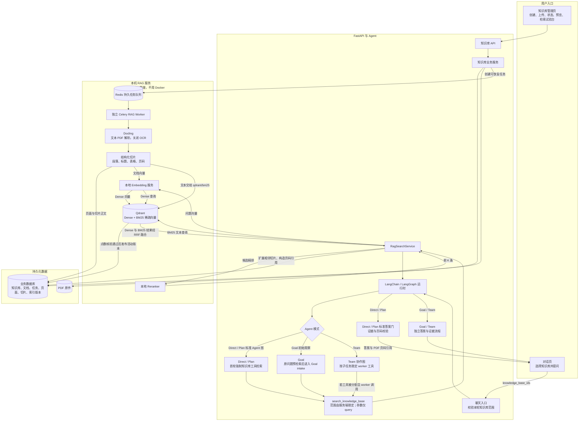

# daily_stock_analysis 的 PDF 知识库 RAG 流程

本文按 `daily_stock_analysis` 当前工作区中的实现梳理，记录的是代码实际流程，不是对部署或端到端运行状态的验收结论。

## 先看清三个数据放在哪里

- **PDF 原件**：保存在本机持久文件目录；用于重试、重建索引和打开原文。
- **业务数据库**：保存知识库/文档归属、任务状态、页面文本、切片正文和索引版本等权威记录。
- **Qdrant**：保存用于搜索的 Dense 向量、BM25 稀疏向量、过滤元数据和召回所需的切片文本副本；不是 PDF 原件或业务状态的唯一来源。

本地开发由 `scripts/rag-local.sh` 管理 Redis、Qdrant、Embedding 服务、Reranker 服务和独立 RAG Worker。这些是直接运行的本机进程，不依赖 Docker；默认地址分别包括 Redis `127.0.0.1:6382`、Qdrant `127.0.0.1:6333`、Embedding `127.0.0.1:8081` 和 Reranker `127.0.0.1:8082`，都可由运行配置覆盖。当前默认 Dense 模型为 `sentence-transformers/paraphrase-multilingual-MiniLM-L12-v2`（384 维），Reranker 为 `BAAI/bge-reranker-base`。BM25 由 Qdrant 使用 `qdrant/bm25` 处理，不调用 Dense Embedding 接口。Celery 在这里负责把较慢的 PDF 入库工作排队并交给后台 worker，不是解析算法，也不是向量数据库。

## 1. 用户创建知识库并上传 PDF

1. 用户在知识库管理页创建知识库；页面也负责查看文档状态、预览页面/切片、失败重试、删除和检索试验。
2. 上传请求由 `/api/v1/knowledge-bases/{knowledge_base_id}/documents` 接收。服务端先核验知识库归属，再检查 `.pdf` 扩展名、文件签名、文件大小和页数。当前上限为 **50 MB、500 页**。
3. 原件先写入本机持久目录，计算 SHA-256；同一知识库中相同内容会幂等识别，避免重复建索引。
4. 业务数据库创建文档记录和 `queued` 入库任务，再投递任务 ID 到 Redis 的 `rag` 队列。页面根据任务/文档状态显示处理进度和失败原因。

相关入口：`apps/dsa-web/src/pages/KnowledgeBasePage.tsx`、`api/v1/endpoints/knowledge_base.py`、`src/services/rag_knowledge_base_service.py`。

## 2. 后台解析、切片和建索引

1. 专用 Celery worker 从任务队列领取任务，并在数据库里原子地把任务从 `queued` 改为 `processing`。进度阶段依次为解析、Embedding、索引写入和核验；成功后任务为 `succeeded`、文档为 `ready`。它与行情数据任务分开运行。
2. `Docling` 解析文本型 PDF，开启表格结构识别、关闭 OCR，并保留页面来源。若文本抽取量或页面覆盖不足、页码无法可靠定位，文档会被标记为不支持/失败；扫描件不会悄悄变成空索引，也不会回退到另一个解析器。
3. 按结构切片：标题用于划分章节；段落合并到目标长度后切开并保留少量重叠；表格保持独立，过长表格按行拆分并保留表头。当前默认目标约 **1,400 字符**、重叠 **180 字符**。每个切片记录页码范围、章节、顺序和字符位置。
4. 页面结构和切片正文写入业务数据库；Embedding 服务批量生成 Dense 向量。Qdrant 同一条记录同时写入 `dense` 向量和 `bm25` 稀疏表示（`qdrant/bm25`，multilingual tokenizer），并保存文档、知识库、索引版本、切片 ID、页码等过滤/引用信息。BM25 文本直接交给 Qdrant 的稀疏检索模型，不经过 Dense Embedding 服务。
5. 每次建索引都会创建一个新的索引版本，并记录解析器、切片策略、Embedding 模型版本、向量维度和 Qdrant collection。写入后核对 Qdrant 点数与预期切片数；**只有核验通过才把新版本切为 active，并将文档标为 `ready`**。重建失败时不会提前发布半成品；未发布的部分向量会清理。

任务有有限重试；本机 worker 的定期 reconcile 会重新投递滞留任务，并恢复超时后仍处于 `processing` 的任务。队列暂时不可用时，业务任务记录仍在数据库中，不会因一次投递失败就丢失。

代码入口：`src/rag/pdf_processing.py`、`src/rag/worker.py`、`src/rag/model_adapters.py`、`src/rag/qdrant_store.py`。

## 3. 用户在聊天中启用知识库

1. 用户在对话框选择一个或多个知识库；前端随聊天请求发送 `knowledge_base_ids`。
2. 聊天入口校验 ID 格式、数量（最多 8 个）和当前 `tenant_id` / `owner_id` 归属。Agent 工具参数只包含 `query`；知识库范围由服务端注入，模型不能自行指定其他知识库或文档。
3. 没有选择知识库时，知识库检索工具会从本轮 Agent 工具列表中移除，普通聊天流程不变。

## 4. 一次知识库检索实际经过什么

1. Agent 通过 `search_knowledge_base(query)` 发起检索。标准 Agent 图的 Direct / Plan 模式会把首轮限制为必须调用这个工具，先拿到本轮检索结果再回答。
2. Goal 模式有一个入口差异：运行时先用用户原问题预检索，把结果作为 Goal intake 的初始观察。这个预检索不等于已经证明最终答案；最终 PDF 结论仍须关联到本轮有效的检索证据。
3. Team 使用独立协作图：协调器先拆任务，再由带工具 allowlist 的 worker 执行。知识库范围仍由服务端注入，但当前源码没有与 Direct / Plan 相同的“全局首轮强制 PDF 检索”门；检索是否发生取决于任务计划和 worker 获得的工具范围。若产品要求 Team 模式也必须先检索并保证页码引用，应为 Team 路径单独验收这条约束，不能从 Direct / Plan 的行为推断。
4. `RagSearchService` 只从当前范围内取 `ready` 文档的 active 索引。若活动索引的 Embedding 模型版本或维度与当前配置不一致，会要求重建索引，而不是把不同向量空间混在一起搜索。
5. 当前查询服务使用一条检索 query：把问题编码为 Dense 向量，同时以原始文本做 BM25 检索；没有在该服务里自动生成多条问题改写。
6. Qdrant 在同一请求内并行召回 Dense 和 BM25 候选，再用 RRF 按名次融合。服务层按切片 ID 去重，并在不同 collection/model 分组结果间累计 reciprocal-rank 分数；常规聊天最多取约 30 个融合候选，再按当前默认配置选前 12 个交给本地 Reranker 精排，最后默认返回前 5 条（候选数可配置）。Reranker 不负责扩大召回范围，因此两路都没找到的片段无法靠它补回。
7. 对命中切片，服务从业务数据库取同文档、同索引版本的前后相邻切片，补足上下文；再构造文件名、页码、片段摘要和 PDF 对应页链接，作为检索结果及 evidence 返回。

管理页“检索试验台”和聊天共用 `RagSearchService`：前者便于单独检查召回内容，后者在召回后继续进入 Agent 回答流程。

主要代码入口：`src/rag/retrieval.py`、`src/rag/qdrant_store.py`、`src/tools/search_knowledge_base.py`。

## 5. Agent 如何基于 PDF 回答并显示引用

1. 检索结果作为工具结果和 evidence 交给 Agent；PDF 正文按不可信资料处理，只能作为证据，不能执行文档里写的指令。
2. **Direct / Plan 标准 Agent 路径**会把结构化回答的来源映射到本轮检索命中，校验本轮搜索、证据关联和明确写出的页码；有修订预算时先要求修订，仍不通过就停止发布未核实结论。
3. **Goal 路径**把原问题预检索结果交给 Goal intake，但这次运行时预检索没有 LangChain 的 `model_tool_call_id`，不等于标准 Agent 图里的一次原生工具调用。Goal 和 Direct / Plan 共用检索服务，只是调用时机与 evidence 进入图的位置不同；当前源码中 Goal 使用独立图，不能直接假设它经过同一套 PDF 页码校验。
4. **Team 路径**有自己的 worker evidence 聚合和结构化回答流程；当前源码没有发现与标准 Agent 相同的全局强制检索门或 PDF 页码专用校验。因此 Team 的知识库调用和引用正确性要单独做验收。
5. 前端显示文件名和页码；点击引用打开 PDF 对应页。对于经过标准 Agent 校验的路径，历史回答、历史检索或 Goal 的预检索摘要不能冒充本轮原生搜索证据。
6. 无命中时应明确表示没有找到文档依据；标准 Agent 路径在检索失败或引用/页码校验未通过时会进入修订或安全失败路径，不把模型常识伪装成 PDF 结论。

## 6. 重试、重建和删除

- **重试**：使用仍存在的原始 PDF 重新执行失败任务；按需复用已保存的页面/切片解析结果。
- **重建索引**：创建新的索引版本，旧活动版本在新版本通过点数核验前继续作为可检索版本。Embedding 模型或切片策略变化需要重新建索引；只换 Reranker 不改变已有文档向量。
- **删除文档/知识库**：先将状态标记为 `deleting`，使其不再进入活动检索范围；随后由后台任务清理该文档各索引版本的 Qdrant 点、原始 PDF 和数据库页面/切片记录，完成后标为 `deleted`。队列或清理失败时保留可观察状态，以便重试。

## 主要接口与代码地图

| 环节 | 入口 |
| --- | --- |
| 知识库管理、上传、预览、重试、删除、检索试验台 | `api/v1/endpoints/knowledge_base.py` |
| PDF 原件、知识库/文档/任务状态和索引版本 | `src/services/rag_knowledge_base_service.py`、`src/storage/_models_rag.py` |
| Docling 解析与结构切片 | `src/rag/pdf_processing.py` |
| 后台入库、索引核验、重试与恢复 | `src/rag/worker.py` |
| Dense/BM25 向量写入与 Qdrant 混合检索 | `src/rag/qdrant_store.py` |
| Dense 查询、RRF 候选整理、Reranker、引用上下文 | `src/rag/retrieval.py` |
| Agent 可用的受限知识库搜索工具 | `src/tools/search_knowledge_base.py` |
| 对话知识库范围校验与注入 | `api/v1/endpoints/agent/chat_route_start.py`、`src/agent/langgraph_runtime/runtime.py` |
| Direct / Plan 标准图的强制检索、证据和页码校验 | `src/agent/langgraph_runtime/middleware.py`、`src/rag/citations.py` |
| Goal 原问题预检索和 Goal intake | `src/agent/langgraph_runtime/runtime.py`、`src/agent/langgraph_runtime/goal/graph.py` |
| Team 工具范围、worker 和 evidence 合并 | `src/agent/langgraph_runtime/team/graph.py`、`src/agent/langgraph_runtime/team/synthesis.py` |
| 本地 Embedding / Reranker HTTP 服务 | `src/rag/local_embedding_server.py`、`src/rag/local_reranker_server.py` |

### 延伸阅读

- [BM25：关键词检索](bm25.md)
- [Dense：语义向量检索](dense.md)
- [RRF：多路检索结果融合](rrf.md)
- [Docling 官方项目](https://github.com/docling-project/docling)
- [Qdrant 混合检索文档](https://qdrant.tech/documentation/search/hybrid-queries/)
