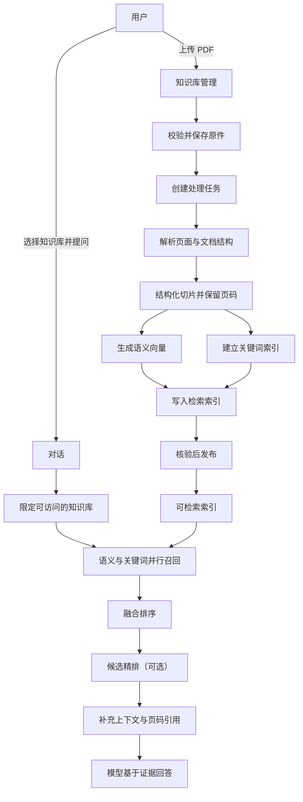

# PDF 知识库 RAG 流程

## 入库

1. 用户创建知识库并上传 PDF；系统校验文件和访问权限，保存原件及文档记录。
2. 后台解析 PDF，提取文本、页面和结构。扫描件按产品支持情况进行 OCR；无法可靠提取的文档应明确报错。
3. 按标题、段落和表格切片，保留页码等来源信息。
4. 为切片建立语义向量索引和关键词索引。索引核验通过后再发布为可检索状态。

## 对话检索

1. 用户在对话中选择知识库并提问；系统只检索用户有权访问的范围。
2. 同时进行语义检索（Dense）和关键词检索（BM25），再用 RRF 合并排序。
3. 可用 Reranker 对候选片段精排；随后补充相邻上下文，并保留文件名、页码等引用信息。
4. 将问题和检索证据交给模型生成回答。证据不足时明确说明未找到依据；引用应能定位到原文。

检索是 RAG 的能力，Agent 是调用它并组织后续工作的流程。可以在知识库问答开始时先检索，也可以由 Agent 按需调用；两者共用检索步骤，调用时机不同。

## 更新与删除

- 重试：使用已保存的原文件重新处理。
- 重建：新索引核验通过后再切换，避免暴露不完整结果。
- 删除：先停止检索，再清理原文件、文档记录和索引。

## 数据分工

- 原文件存储：保存 PDF，用于查看和重新处理。
- 文档数据库：保存知识库、任务、页面、切片和索引状态。
- 检索索引：保存用于语义和关键词召回的数据。

相关原理：[Dense](dense.md)、[BM25](bm25.md)、[RRF](rrf.md)。
