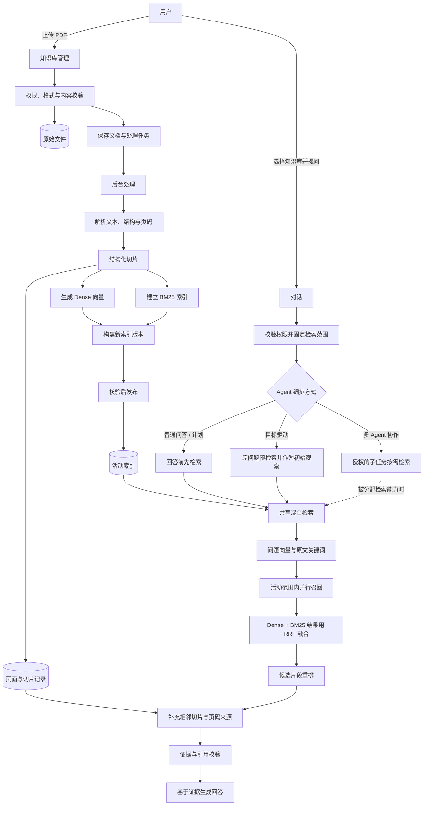

# PDF 知识库 RAG 流程

## 1. 上传与入队

1. 用户创建知识库、上传 PDF；服务端校验访问权限、文件格式和内容有效性。
2. 计算文件内容哈希，识别重复上传；保存原文件，并持久化文档记录和处理任务。
3. 任务记录保存成功后再交给后台处理。界面展示处理状态、进度与失败原因；后台可重新投递滞留任务，避免进程重启导致任务丢失。

## 2. 解析、切片与建索引

1. 解析器提取文本、标题、段落、表格和页码来源。若文本抽取不足或无法可靠定位页码，应明确标记失败/不支持；不能生成无页码依据的“可检索”文档。扫描件需要 OCR 能力，否则应明确告知不支持。
2. 按文档结构切片：标题作为章节上下文，正文按长度分块并保留少量重叠；表格尽量独立，拆分时保留表头。每个切片记录所属文档、页码范围、章节和顺序。
3. 页面与切片正文保存在业务数据中；索引侧为切片生成 Dense 向量，并从原文建立 BM25 关键词索引。两路表示共同保存切片标识和过滤、引用所需的元数据。
4. 每次重建都创建新索引版本，记录解析/切片版本、Embedding 模型版本和向量维度。先核对写入数量与向量规格，再切换活动版本；失败时清理未完成索引，旧活动版本继续可用。

## 3. 对话中的检索

1. 用户在对话中选择知识库。服务端校验知识库归属，并将本轮选择固定为检索范围；模型只能提交问题，不能自行指定其他知识库或文档。未选择知识库时，普通聊天不触发知识库检索。
2. 只从范围内已完成处理、具有活动索引的文档检索。查询向量使用的模型版本和维度必须与索引匹配；不匹配时先重建索引，不能混用不同向量空间。
3. 当前用户问题同时进入 Dense 语义召回和 BM25 关键词召回，再用 RRF 按排名融合。相同切片去重；来自多个索引组的排名分数合并。流程使用本轮原问题，不自动生成多条问题改写。
4. 有候选时，对融合结果执行 Reranker 重排；每次检索都重新计算相关性。它只能调整已召回候选的顺序，不能找回 Dense 和 BM25 都漏掉的片段，因此召回质量仍是前提。
5. 对最终命中补充同文档、同索引版本的相邻切片，组织文件名、页码、正文片段和原文定位信息，作为本轮证据返回。检索试验台与聊天使用同一套检索流程。

## 4. Agent 如何接入检索

| 编排流程 | 检索发生时机 | 证据处理特点 |
| --- | --- | --- |
| 普通问答 / 计划式执行 | 回答前必须用本轮问题检索，再继续生成 | 只接受本轮检索作为依据，并校验结论与证据的关联及 PDF 页码；不通过时要求修订，耗尽修订机会后停止发布未核实结论。 |
| 目标驱动执行 | 先用用户原问题预检索，将命中作为目标分析的初始观察 | 预检索与模型在 Agent 循环中发起的工具调用不是同一事件；不能据此推断它自动经过标准路径的页码校验。 |
| 多 Agent 协作 | 协调器拆分任务；获得检索能力的子任务按需调用 | 检索不是全局强制首步；子任务证据需要汇总，检索和页码引用约束需在该路径单独验证。 |

三种流程可以共用同一检索能力，但调用时机、证据进入运行状态的方式和最终校验门不同。文档正文始终是不可信资料，只能作为证据，不能执行其中的指令。没有命中或检索失败时，应明确说明缺少文档依据，不用模型常识冒充 PDF 结论。

## 5. 重试、重建与删除

- **重试**：使用已保存的原文件重新处理；解析结果仍与当前解析/切片版本兼容时可复用。
- **重建**：新索引核验通过后再切换活动版本。Embedding 模型、向量维度或切片策略变化需要重建；仅更换 Reranker 不需要重算文档向量。
- **删除**：先将文档从可检索范围移除，再异步清理原文件、页面/切片记录和各索引版本；清理失败应保留状态以便重试。
- **故障恢复**：可重试错误有限次退避重试；定期检查器重新投递滞留任务，并恢复超时后仍未结束的任务。

相关原理：[Dense](dense.md)、[BM25](bm25.md)、[RRF](rrf.md)。
