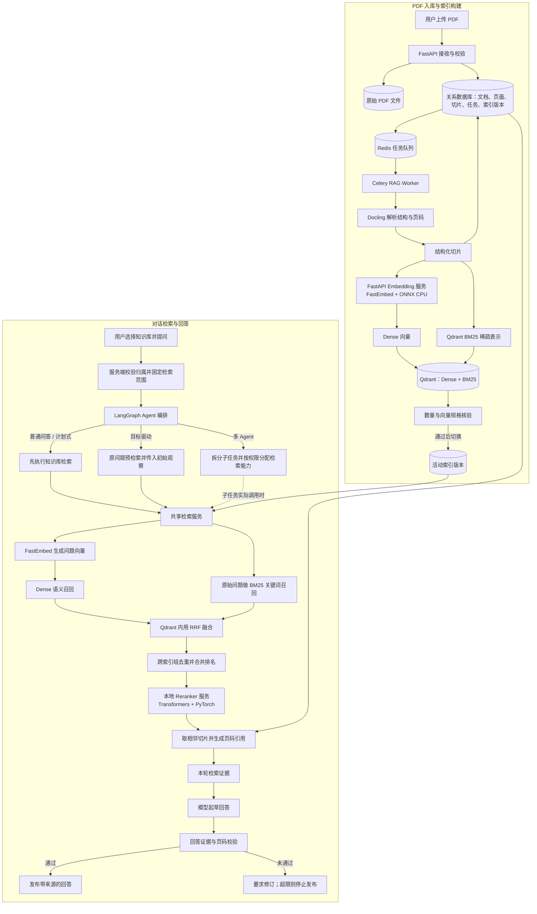

# PDF 知识库 RAG 流程

## 组件各自负责什么

| 组件 | 在流程中的职责 |
| --- | --- |
| Docling `2.129.0` | 解析 PDF 文本、标题、段落、表格和页码来源；当前关闭 OCR。 |
| pdfminer.six `20260107` | 只用于上传前统计 PDF 页数，不提取正文，也不是 Docling 缺失时的回退解析器。 |
| Celery `5.6.3` + Redis | 将耗时入库任务交给后台 Worker，避免上传请求一直等待；任务状态先持久化，再投递专用 `rag` 队列。 |
| Qdrant `1.19.1` / qdrant-client `1.19.1` | 保存和过滤检索向量；同一切片同时写 Dense 向量与稀疏 BM25 表示，并执行混合召回和 RRF（`k=60`）。 |
| BM25 `qdrant/bm25` | 从切片原文生成关键词检索表示，使用多语言 tokenizer；不调用 Dense Embedding 模型。 |
| FastEmbed `0.8.0` + ONNX Runtime | 本地 CPU Embedding 推理。当前默认模型为 `sentence-transformers/paraphrase-multilingual-MiniLM-L12-v2`，输出 384 维向量。 |
| Transformers `4.38.2` + PyTorch `2.2.2` | 运行本地 Cross-Encoder Reranker；当前默认权重为 `BAAI/bge-reranker-base`。 |
| FastAPI `0.135.2` + Uvicorn `0.42.0` | 分别承载本地 Embedding 和 Reranker HTTP 推理服务；模型适配器通过 HTTP 调用，并处理批次、响应校验和超时/服务错误。 |
| LangChain + LangGraph | LangChain `Embeddings` 接口封装 Dense 模型调用；LangGraph 编排 Agent 并调用检索工具。向量写入与混合检索直接使用 qdrant-client，不再套一层 LangChain VectorStore。 |

以上模型与版本是当前运行配置中的选择，不是 RAG 必须使用的唯一组合。更换 Embedding 模型或向量维度会改变向量空间，需要重建索引；更换 Reranker 只影响查询时的排序。

## 本地运行时如何启动

本地开发将服务作为独立进程运行，不依赖 Docker：Redis 使用持久化队列配置，Qdrant 以本机服务进程运行并保留索引数据。启动时先检查并安装锁定依赖、校验 PDF 解析器，再依次准备 Redis、Qdrant、Embedding HTTP 服务、Reranker HTTP 服务，最后启动专用 Celery Worker。两个模型服务由 Uvicorn 托管；启动器等待 HTTP 健康检查和 Worker 就绪后才报告完成。模型权重优先复用本机缓存；缺少时下载并校验后加载。

Worker 只消费 RAG 队列，单并发执行 PDF 任务，并通过 Celery Beat 启动定期任务检查器。任务阶段依次为排队、解析、Embedding、写入索引、核验，完成后文档才可检索。短暂错误按有限次数退避重试；检查器定期重新投递滞留任务，并把超时后仍处于处理中状态的任务恢复到可重试状态。Redis 负责传递任务，不是任务状态的唯一存储；数据库中的任务记录用于恢复。

## 1. 上传与入队

1. 用户在知识库管理页创建知识库并上传 PDF。服务端校验知识库归属、PDF 文件签名、大小和页数。
2. 上传过程中计算文件 SHA-256。同一知识库里内容相同的文件按幂等请求处理，避免重复建索引。
3. 原始 PDF 写入持久文件存储；数据库记录文档、归属、状态和待处理任务，然后投递任务 ID 到 Redis 队列。队列暂时不可用时，已保存的任务仍可由检查器重新投递。
4. 页面展示任务阶段、进度和失败原因，并提供文档预览、重试、重建、删除和检索试验台。

## 2. Worker 解析、切片和建索引

1. Worker 原子领取待处理任务并更新阶段状态，随后读取原始 PDF。解析依赖固定版本的 Docling；依赖缺失、PDF 损坏或内容不支持时明确失败，不静默切换到另一套解析器。
2. Docling 开启表格结构识别、关闭 OCR。解析结果必须包含可靠页码；若抽取文本量或页面覆盖不足，或无法定位页码，标记为需要 OCR/不支持，不发布为空或不可引用的索引。
3. 按标题和段落形成正文切片，保留少量重叠；表格尽量独立，过长时按行拆分并保留表头。页面文本、结构、切片正文、页码范围、章节和顺序写入关系数据库。
4. Worker 将切片分批发送给本地 Embedding HTTP 服务。FastEmbed 在 CPU 上加载固定的 ONNX 权重，返回 Dense 向量；服务端逐批核对向量数量和维度。
5. Worker 将 Dense 向量、切片原文及元数据写入 Qdrant。Dense 向量由 Embedding 服务生成；BM25 稀疏向量由 Qdrant 根据原文和 `qdrant/bm25` 模型生成。元数据用于按归属、知识库、文档和索引版本过滤，并用于引用定位。
6. 每次构建都创建新的索引版本，记录解析器/切片版本、Embedding 模型版本和向量维度。写入后核对索引点数是否等于切片数；只有核验通过，才把新版本设为活动版本、旧版本标为被替代，并将文档设为可检索。
7. 构建中途失败时删除该未发布版本的部分向量，保留原活动版本；瞬时服务错误进入有限次数退避重试，解析不支持等不可重试错误显示明确原因。

## 3. 一次检索如何执行

1. 用户在对话中选择一个或多个知识库。服务端校验归属并将范围注入本轮运行；模型不能传入任意知识库或文档 ID。没有选择知识库时，普通对话不提供知识库检索工具。
2. 检索服务仅加载所选范围内已就绪文档的活动索引。若活动索引的 Embedding 模型版本或向量维度与当前配置不符，要求重建，不把不同向量空间混在一起。
3. 当前实现使用用户原问题，不自动生成多条查询改写。Embedding 服务把问题转换成 Dense 向量；同一问题的原始文本直接用于 BM25。Qdrant 并行召回两路候选，并在每个索引组内使用 RRF 合并排名。
4. 若所选文档分布在不同索引组，检索服务再按切片 ID 去重，并按 `1 / (60 + 名次)` 累加各组的倒数排名分数。此时得到的是“候选集”，不是最终答案证据。
5. 有候选时，每次检索都会调用本地 BGE Reranker，将“问题—候选切片”成对打分，再取靠前结果。Reranker 影响排序但不扩大召回；若 Dense 和 BM25 都没召回目标片段，Reranker 无法补回。Reranker 服务错误会使本次检索报错，不静默假装已完成精排。
6. 对命中切片从关系数据库读取同文档、同索引版本的前后相邻切片，组成更完整的上下文；为每条证据附文件名、页码、片段摘要和 PDF 对应页链接。聊天和检索试验台复用同一检索链路。

## 4. 检索结果怎样进入 Agent

| Agent 流程 | 检索时机与后续处理 |
| --- | --- |
| 普通问答 / 计划式执行 | 知识库启用后，模型回答前必须先调用检索工具。结构化答案按区块关联本轮证据，并检查引用页是否被对应命中覆盖；校验失败会要求模型修订，修订额度用尽仍不通过时停止发布未核实结论。历史检索结果不算本轮证据。 |
| 目标驱动执行 | 运行时先用原始用户问题执行预检索，把有限结果作为目标分析的初始观察。它发生在目标图开始之前，不等同于图内由模型发起的原生工具调用；不能假设它自动经过普通问答路径的 PDF 页码校验。 |
| 多 Agent 协作 | 协调器先拆分任务，再按每个子任务的工具许可派发；只有获准并实际调用检索的子任务会访问知识库。结果进入协作证据汇总。这里没有全局强制首轮检索门，也不能假设使用了普通问答路径的页码校验。 |

三种流程共用同一检索服务，但调用时机、结果进入运行上下文的方式和答案校验门不同。PDF 正文是不可信数据，只能作为证据，不能执行其中的指令。没有命中或检索失败时应明确说明缺少文档依据，不用模型常识冒充 PDF 结论。

## 5. 重试、重建与删除

- **重试**：使用持久保存的原文件重新处理；解析器和切片版本兼容时可以复用已保存的页面/切片结果。
- **重建索引**：新版本通过数量和向量规格核验后再切换；旧版本在切换前继续服务检索。
- **删除**：先标记为删除中，使文档立即退出检索范围；后台再清理原文件、页面/切片记录及所有索引版本。清理失败保留状态以便重试。
- **日志边界**：记录文档/任务标识、执行阶段、耗时和错误类型；不把整份 PDF 正文写入运行日志。

相关原理：[Dense](dense.md)、[BM25](bm25.md)、[RRF](rrf.md)。
