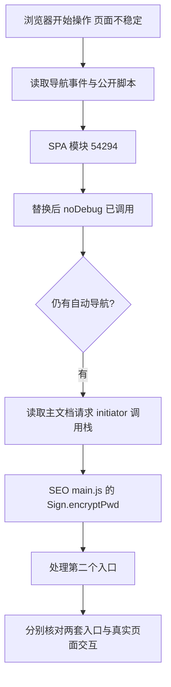
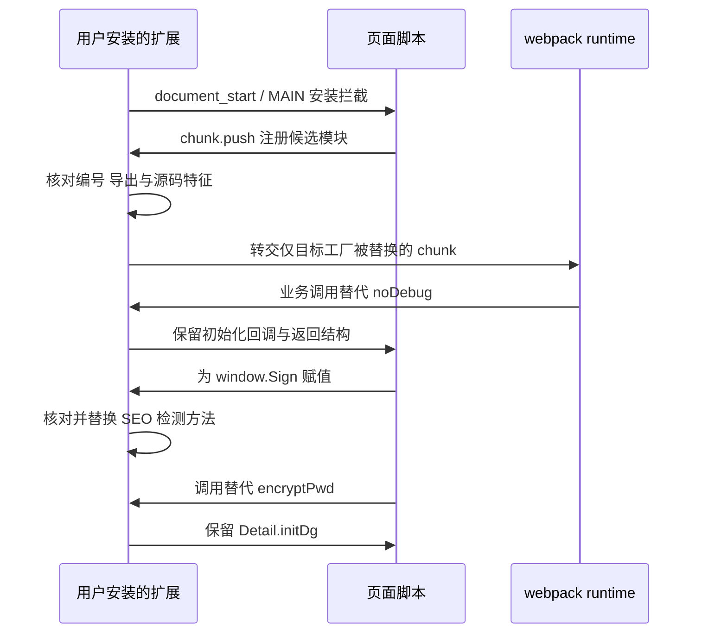
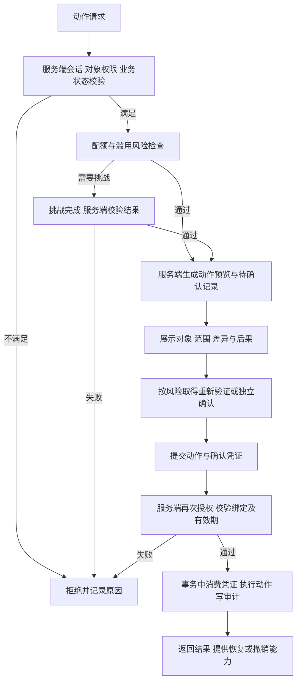

# 浏览器 Agent 操作防护：BOSS 页面反调试问题复盘与设计参考

记录日期：2026-10-09。案例基于当时页面的公开脚本、本地扩展 0.1.2、针对性测试和实际 Chrome 操作。本文供自建网站设计、授权调试和防护验收参考。

**这次案例证明：前端反调试能够干扰依赖浏览器调试接口的自动化，但不能可靠阻止有权限控制浏览器的 Agent。** 两套检测都可以在初始化前被替换。自建网站应把前端检测作为风险信号，把禁止的操作落实到服务端授权、业务约束和操作确认中。

## 1. 问题与目标

用户授权 Agent 更新自己的在线简历。浏览器控制开始后，页面出现反复刷新、标签连接丢失、元素索引失效等现象，无法稳定填写和保存。用户希望临时解决页面干扰，恢复正常操作。

最初不能仅凭“页面在刷新”认定网站针对 AI。抓包代理、浏览器连接问题、脚本异常、路由跳转和反调试检测都可能产生相似表现。本次最终取得了脚本主动导航的调用栈，并核对了对应检测代码。

这里的“解决”是针对这一用户授权场景，让当前页面版本恢复可操作；没有绕过登录、验证码、服务端权限或浏览器安全提示，也没有证明网站能识别操作方是不是 AI。

## 2. 定位：两套独立检测，而非一个入口

### 2.1 SPA 的 webpack 检测模块

公开脚本：

```text
https://static.zhipin.com/zhipin-geek-spa/web/v6750/static/js/vendor-1.a73b9143.js
webpack 队列：window.webpackChunkgeek
模块编号：54294
唯一导出：noDebug
```

核验到的检测包括 DOM 属性 getter、Date/Function 的 `toString` 调用，以及控制台输出耗时。检测动作可能改变窗口历史、关闭窗口、清空页面、导航或隐藏内容。代码中的方法名称和日志标记只能用于定位，不能单独证明检测已执行。

目标模块截取源码的 SHA-256：

```text
5022476bf5f6ce717b92bb912314e1af25a75b0695f8553947e1b0ee3ea00e3c
```

这些方法与 [disable-devtool 的公开检测模式](https://github.com/theajack/disable-devtool#35-monitoring-mode)有相似之处，但本次匹配依据是实际页面源码；没有假定网站暴露该库的全局变量，也没有确认它直接使用了这个库。

### 2.2 SEO 脚本还有独立检测

0.1.1 的 SPA 补丁实际被调用后，页面仍然刷新。进一步读取 Chrome DevTools Protocol 的导航事件，观察到主文档发生 `scriptInitiated` 导航。Document 请求的 initiator 调用栈指向：

```text
https://static.zhipin.com/zhipin-geek-seo/v5447/web/geek/js/main.js
CDP：lineNumber = 0，columnNumber = 660488
按常用的一基编号：第 1 行，第 660489 列
入口：Sign.encryptPwd()
```

核对源码后发现，`Sign.encryptPwd()` 内部初始化了另一套检测器。这个具体方法的行为不是正常登录密码加密；判断来自方法体，而不是名称。原有 `initAesEncrypt`、`encryptPasswd` 等业务方法未被替换。

因此，“SPA 替代函数已经调用”与“页面仍自动刷新”可以同时成立。问题是还有第二个检测入口，而不是第一个补丁必然没有运行。



文字流程：先取得实际导航来源，再核对方法体；每处理一处入口，就观察还有没有自动导航。一个入口的成功计数不代表所有脚本都已处理。

## 3. 插件如何临时解决问题

### 3.1 尽早进入页面自身的执行环境

扩展使用 Manifest V3 静态 content script，配置 `run_at: document_start` 和 `world: MAIN`，只匹配推荐页与简历页。Chrome 默认的隔离世界不能直接替换页面 JavaScript 中的同名对象；这里需要进入页面执行环境，并在对应业务脚本初始化前安装拦截。[Chrome content scripts 文档](https://developer.chrome.com/docs/extensions/develop/concepts/content-scripts)

时间点是关键。检测器运行后可能已经保留函数引用、创建定时任务或触发导航。事后改一个全局名称不一定能撤销已有副作用。

### 3.2 在 webpack 注册前替换工厂

插件拦截 `window.webpackChunkgeek` 的赋值及队列的 `push`，在 chunk 交给 webpack runtime 前检查模块 `54294`。只在以下六项源码特征同时满足时，替换该模块工厂：

- 导出结构只有 `noDebug`，避免丢掉未来新增的业务导出。
- 存在 `this.date.toString` 赋值。
- 存在 `this.func.toString` 赋值。
- 存在 `eventType: "dts"`。
- 存在 `eventType: "method_modify"`。
- 存在 `this.largeObjectArray`。

替代函数保留 `appName` 校验、初始化回调及 `{ success, reason, check }` 接口形状，跳过检测器创建。其他模块工厂、chunk 的 runtime callback、`push` 的接收者和返回值继续按原流程执行。

webpack 会重设队列的 `push`，因此只拦截最初的 `Array.prototype.push` 不够；扩展也处理队列实例的后续 `push` 赋值。原生 `Array.prototype.push` 本身没有被改动。

### 3.3 在 Sign 全局赋值时处理 SEO 入口

第二处拦截挂接 `window.Sign` 的赋值。拿到对象后，核对 `encryptPwd` 方法中的八项特征，包括 Date/Function 检测、事件标记、应用名、检测初始化调用及 `Detail.initDg()` 回调。

匹配后只替换这一个方法，跳过独立检测的初始化，并保留 `Detail.initDg()` 及其异常捕获。这个回调还影响后续 `Detail.dgTag === Sign.pwdDetail` 检查；简单换成空函数会丢掉原页面所需的初始化语义。

匹配失败时保留原方法并报告状态。没有全局覆盖 `console`、计时器、Function/Date 原型、Location 或网络请求，也没有增加扩展 API 权限。



### 3.4 三个容易误判的地方

| 问题 | 原因 | 修正 |
| --- | --- | --- |
| 从推荐页进入简历时没有注入 | 首版只匹配简历页，初始推荐文档未安装拦截 | 同时覆盖两种入口，并保持运行时路径校验；其他入口仍需在目标页刷新 |
| 显示“已替换”，实际仍用旧模块 | webpack 已把工厂复制进内部模块表，修改旧队列不等于修改运行时 | 检测已启动的 runtime，提示重新加载扩展并刷新；不宣称事后替换有效 |
| 显示“已跳过”却仍刷新 | 只记录了 SPA 入口，遗漏独立 SEO 检测 | SPA 与 SEO 分别显示状态和调用计数 |

状态区分“等待模块”“已替换待调用”“替代函数已调用”“源码不匹配”“需刷新”。修改磁盘中的扩展代码后，还要重新加载扩展并刷新网页，旧文档不会自动切换到新逻辑。

## 4. 验证与证据边界

### 4.1 离线验证

0.1.2 的语法检查及 17 项针对性测试通过。测试覆盖 webpack 启动前注册、`push` 重设、队列替换、其他模块保留、接口校验、回调异常、路径范围、事后注入状态，以及真实 SPA 模块和当日 SEO 方法的源码匹配。

SEO 测试还模拟了 `var Sign = ...` 后立即调用的顺序，并确认其他业务方法保留、`Detail.dgTag` 的初始化结果满足原脚本检查。测试中不执行原始破坏性检测逻辑。

### 4.2 真实 Chrome 验证

最终只包含补丁元数据的观测结果如下，未公开账号、简历正文、Cookie、请求凭据或个人截图：

```json
{
  "version": "0.1.2",
  "phase": "bypassed",
  "patchedFactoryCount": 1,
  "noDebugCalls": 1,
  "seoPhase": "bypassed",
  "seoCalls": 1,
  "callbackErrorCount": 0,
  "recommendObservationSeconds": 15,
  "resumeObservationSeconds": 15,
  "automaticNavigationEvents": 0,
  "previewOpenedAndClosed": true
}
```

两处替代入口实际调用；推荐页及从推荐页进入的简历页分别观察 15 秒，未记录自动导航，预览能正常打开和关闭。随后正常 UI 保存项目条目并刷新回读成功，进一步证明当时的业务操作恢复。

这证明的是当时 Chrome、账号会话和脚本版本中的指定操作，不代表长期无误报、所有业务路径可用、其他浏览器适用或网站以后升级仍有效。模块编号、压缩变量名与源码特征都可能变化。

## 5. 对自建网页防护的启示

### 5.1 先定义禁止的行为

“AI Agent”是一种操作工具，不是权限或恶意性的可靠标识。同一个浏览器可能用于用户授权协作，也可能用于越权、批量抓取或错误执行。防护目标应写成可核验的业务规则：谁可以读哪些数据、修改哪些对象、导出多少内容，以及哪些动作需要另一次确认。

| 场景 | 应防护的行为 | 主要控制点 |
| --- | --- | --- |
| 匿名自动化 | 高频读取、枚举、刷接口 | 服务端配额、速率限制和按风险触发的挑战 |
| 已登录账号 | 越权访问其他用户或租户对象 | 每次请求的对象级授权与租户边界 |
| 用户授权的浏览器 Agent | 误删、误发布、扩大操作范围 | 明确差异预览、受限授权、操作确认与恢复机制 |
| 攻击者控制用户浏览器或扩展 | 读取页面、改客户端代码、使用现有会话 | 限制会话权限；对关键动作采用独立的确认渠道及重新验证 |

如果 Agent 能控制已登录浏览器，而服务端只要求携带这个会话，它可能拥有与用户相同的请求能力。隐藏按钮或前端检测不会自动改变这些权限。普通网页弹窗也不能证明点击者是人。

### 5.2 哪些信号不能作为授权依据

| 做法 | 可起的作用 | 局限 |
| --- | --- | --- |
| Date/Function/console 反调试 | 干扰部分调试型自动化 | 初始化入口可被替换；也可能误伤正常调试与辅助工具 |
| `navigator.webdriver`、行为节奏 | 辅助风险评分 | 不能证明恶意；存在误报，也不能涵盖所有自动化方式 |
| `event.isTrusted` | 标记事件来源的一部分信息 | 浏览器级自动化也可能产生可信输入，不能证明人的意图 |
| 前端 `isAgent` 或风险分数 | 提供客户端观测 | 客户端提交的数据可伪造，不应单独批准或拒绝关键权限 |
| CSP、代码混淆 | 限制特定注入途径或增加分析成本 | CSP 主要用于减轻 XSS；不能当成阻止所有浏览器扩展或已授权控制的承诺 |

CSP 的目标和部署边界见 [OWASP CSP 指南](https://cheatsheetseries.owasp.org/cheatsheets/Content_Security_Policy_Cheat_Sheet.html)。上表中关于本案例客户端可替换性的判断来自实际观测，不是声称任何防护均无作用。

本例中的刷新、清空 body、关闭窗口和大量对象分配不适合作为默认防护模板。它们可能中断编辑、造成数据丢失或资源问题，却没有建立服务端授权边界。自建页面若需要前端风险检测，应采用有成本上限、可撤销、有明确提示的处理，避免循环刷新。

## 6. 可复用的防护流程

### 6.1 将有副作用的动作收敛到服务端

每个写接口都校验会话、主体权限、对象归属及业务状态。前端取消检查、直接请求接口或伪造客户端字段，仍不能扩大授权范围。默认拒绝，并逐请求核对权限，参照 [OWASP Authorization 指南](https://cheatsheetseries.owasp.org/cheatsheets/Authorization_Cheat_Sheet.html)。

对删除、发布、批量导出或权限变更等动作，可以采用以下架构。这里是设计建议，尚未在用户自建应用实现或验收：



具体约束：待确认记录由服务端生成，并绑定用户、会话、动作、对象、对象版本和规范化后的参数摘要；确认后不能换对象或扩大范围。凭证要有短有效期，并在事务中一次性消费。幂等键用于处理同一动作的重试，不能当成授权依据。执行前再次检查权限与状态，避免确认期间对象或授权已经改变。

确认界面要让用户看见实际对象、差异、数量和不可恢复后果。若威胁包含浏览器被控制，单纯同页“确认”不够，应按风险引入独立可信的确认渠道；重新验证也不能保证系统知道用户真实意图。上述设计参考 [OWASP Transaction Authorization 指南](https://cheatsheetseries.owasp.org/cheatsheets/Transaction_Authorization_Cheat_Sheet.html)，具体绑定字段和状态机是本文的工程建议。

### 6.2 对自动化滥用设置业务配额

按账号、租户、资源、操作类型和必要的网络维度限制请求，不只依赖 IP；分别控制读取、搜索、批量导出和写操作。配置值由正常流量基线、资源成本及误报容忍度确定。返回可解释的拒绝或稍后重试结果，不让前端陷入刷新循环。

挑战组件必须在服务端验证。以 [Turnstile 官方服务端验证文档](https://developers.cloudflare.com/turnstile/get-started/server-side-validation/)为例，仅显示组件或收到前端“成功”不代表有效验证；应检查验证结果及预期上下文。挑战通过不等于用户获得对象权限，也不证明随后每个动作都是用户意愿。不要自研纯前端“反 AI 口令”替代服务端验证。

### 6.3 保留基础安全与恢复能力

Cookie 会话写接口继续实施 CSRF 防护，按应用架构使用框架支持、令牌及来源检查，合理配置 SameSite。它解决跨站伪造请求，不能阻止已经控制同源页面和会话的 Agent；见 [OWASP CSRF 指南](https://cheatsheetseries.owasp.org/cheatsheets/Cross-Site_Request_Forgery_Prevention_Cheat_Sheet.html)。

有条件时优先软删除、版本历史或可撤销发布，并记录主体、对象、动作、授权结果、前后版本及关联请求标识。日志避免保存凭据和不必要的敏感正文。风险策略先观察误报再逐步启用限制，提供人工恢复路径。

若产品主动支持 Agent，应给它独立身份和最小权限：限定资源、动作、有效期及配额，默认不赋予批量导出和永久删除权限。这比让 Agent 长期复用用户全部会话权限，更便于撤销、审计和控制范围。

## 7. 下次开发时的验收清单

以下是待执行清单，不表示本次已完成这些服务端防护测试：

- [ ] 在自己的测试环境关闭或替换前端风险检测，服务端仍拒绝未授权操作。
- [ ] 直接调用写接口、修改对象 ID 或租户 ID，不能越权。
- [ ] 伪造 `isAgent=false`、点击来源或客户端风险分数，不能获得额外权限。
- [ ] 确认后修改对象、参数、数量或对象版本，执行被拒绝或要求重新确认。
- [ ] 过期、重复使用、跨账号使用确认凭证均失败；同一幂等动作不会重复执行。
- [ ] 高并发和重复请求受限，正常辅助工具及用户授权自动化不会被无差别封禁。
- [ ] 挑战结果由服务端验证，失败或缺失时不能通过需要挑战的操作。
- [ ] 正常用户、开发者工具、慢设备、键盘操作和辅助技术不会触发无限刷新或丢失编辑内容。
- [ ] SPA 初始入口、路由跳转、刷新和多个脚本入口都已覆盖，诊断状态能区分观测与真实执行。
- [ ] 删除和发布的审计记录、恢复流程及策略撤销路径经过实际演练。

## 8. 来源与复现边界

案例一手依据：2026-10-08 至 2026-10-09 对上文公开 SPA/SEO 脚本的核验、本地扩展 0.1.2 的实现、17 项测试，以及实际 Chrome 导航事件、状态计数和保存后回读。文中保留公开脚本版本及最小计数，未上传第三方整包代码、个人简历截图或浏览器凭据。网站脚本地址可能更新或失效，源码特征需要重新核验。

平台与工程参考均在对应章节直接链接：Chrome content scripts、disable-devtool 原仓库、OWASP 授权/操作授权/CSRF/CSP 指南及 Turnstile 服务端验证文档。案例事实、由案例推导的限制与自建网站设计建议分别陈述；前端补丁运行成功不能充当服务端防护有效性的证据。
