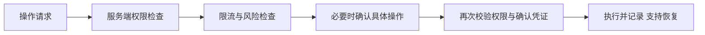

# 浏览器 Agent 操作防护：反调试原理与防护设计

**前端反调试能干扰部分自动化，但能被绕过。要防止越权、误删和批量操作，必须在服务端限制权限和行为。**

## 1. 页面为什么会反复刷新

BOSS 页面中有两套独立检测：一套在 SPA 模块里，另一套在公共脚本里。它们通过浏览器调试时的行为差异判断是否开启调试，命中后刷新或隐藏页面。

| 检测方式 | 原理 | 问题 |
| --- | --- | --- |
| DOM 属性 getter | 调试工具展示对象时，可能读取特定属性 | 不能据此判断操作是否恶意 |
| Date / Function 的 `toString` | 检查对象展示时的方法调用 | 行为受浏览器和调试方式影响 |
| 控制台输出耗时 | 比较输出不同对象的时间差 | 性能波动可能造成误判 |
| 原生方法检查 | 检查方法是否被替换 | 检测入口本身也可能被替换 |

这些方法检测的是调试行为，不能准确判断“是不是 AI”或“是否经过用户授权”。

## 2. 这次怎么解决

先抓刷新来源，再在检测初始化前替换入口。替代函数保留正常业务需要的回调和返回值，跳过检测器创建。

| 步骤 | 做法 | 目的 |
| --- | --- | --- |
| 找到刷新来源 | 读取浏览器导航事件及调用栈，检查对应脚本 | 区分脚本刷新、路由跳转和连接故障 |
| 提前注入 | 扩展使用 `document_start` 和 `MAIN` | 在页面脚本启动前进入同一执行环境 |
| 处理 SPA 检测 | 拦截 webpack 模块注册，核对源码特征后替换目标工厂 | 阻止检测器初始化，保留其他模块 |
| 处理公共脚本检测 | 拦截全局对象赋值，核对并替换其中的检测方法 | 处理 webpack 之外的独立入口 |
| 保留业务行为 | 保留参数校验、初始化回调和返回结构 | 避免页面功能随检测一起失效 |
| 验证结果 | 分别检查各入口，再操作页面并刷新回读 | 确认检测跳过且业务能保存 |

关键点：

- **必须足够早。** 检测运行后可能已经创建定时任务或触发导航，事后替换函数无法撤销这些动作。
- **必须找全入口。** 处理一套检测后仍刷新，应继续查调用栈，而不是重复修改同一处。
- **必须核对方法体。** 不能仅凭函数名判断它是检测逻辑还是业务逻辑。
- **必须实际操作验证。** “模块已替换”不等于“替代函数已调用”，更不等于“页面功能正常”。

本次处理两套入口后，观察期间未再出现自动刷新，预览、保存和刷新回读正常。这个结果只适用于当时测试的页面；网站改版后需要重新核验。

## 3. 为什么这种防护能被绕过

页面 JavaScript 在用户的浏览器中运行。有权限的扩展可以进入页面执行环境，在检测启动前替换函数。检测代码再复杂，也不能代替服务端权限检查。

| 做法 | 能解决什么 | 不能保证什么 |
| --- | --- | --- |
| 反调试、混淆 | 增加分析和自动化成本 | 阻止有浏览器控制权限的操作者 |
| `navigator.webdriver`、行为评分 | 提供自动化风险信号 | 准确判断恶意和用户授权 |
| `event.isTrusted` | 提供事件来源信息 | 证明操作来自人的真实意愿 |
| 隐藏按钮、前端禁用 | 限制普通界面操作 | 阻止直接请求接口 |
| 同页确认弹窗 | 提醒用户检查操作 | 阻止能控制页面的 Agent 点击确认 |
| CSP | 减轻部分脚本注入风险 | 阻止所有扩展或浏览器控制方式 |

## 4. 自己开发页面时怎么防护

先定义禁止的行为：越权读写、过量导出、批量删除、未经确认的发布。不要只判断操作方是不是 Agent。

| 需求 | 实现方式 |
| --- | --- |
| 防越权 | 每个接口检查用户、租户、对象归属和操作权限 |
| 防批量滥用 | 按账号、租户、资源和操作类型设置限流与配额 |
| 防误删、误发布 | 展示具体对象和修改差异；关键操作要求确认 |
| 防确认后换参数 | 服务端确认凭证绑定用户、动作、对象、版本和参数摘要，短期有效、一次使用 |
| 防浏览器被控制 | 高风险操作使用独立确认渠道；同页弹窗不足以保护此场景 |
| 防跨站伪造请求 | Cookie 会话写接口使用 CSRF 防护；它不能阻止已控制同源页面的 Agent |
| 防验证码结果伪造 | 在服务端验证挑战结果；验证通过仍要检查业务权限 |
| 限制授权 Agent | 给独立身份，限定资源、操作、有效期和配额 |
| 降低错误损失 | 软删除、版本历史、撤销机制和操作审计 |

前端检测只作为辅助信号。关闭或替换前端检测后，服务端仍应拒绝未授权操作。不要用循环刷新、清空页面或耗尽内存作为默认处理方式，这会伤害正常用户，却不能建立权限边界。

## 5. 验收清单

| 测试 | 预期结果 |
| --- | --- |
| 关闭前端检测、直接请求接口 | 未授权操作仍被拒绝 |
| 修改对象 ID 或租户 ID | 无法访问其他用户的数据 |
| 伪造客户端“非 Agent”标记 | 无法获得额外权限 |
| 确认后换对象、扩大范围或修改参数 | 必须重新确认 |
| 使用过期、重复或跨账号的确认凭证 | 请求被拒绝 |
| 重试同一写操作 | 不重复执行；幂等键不能代替授权 |
| 高并发、批量导出 | 受到配额限制 |
| 使用开发者工具、慢设备或辅助工具 | 不无限刷新，不丢失编辑内容 |
| 删除或发布出错 | 能按设计恢复或撤销，审计记录完整 |

这些是自建应用的待测项，不代表本次已经验证了服务端防护。

## 参考资料

- [Chrome content scripts：注入时间与执行环境](https://developer.chrome.com/docs/extensions/develop/concepts/content-scripts)
- [disable-devtool：反调试检测方式](https://github.com/theajack/disable-devtool#35-monitoring-mode)
- [OWASP：服务端授权](https://cheatsheetseries.owasp.org/cheatsheets/Authorization_Cheat_Sheet.html)
- [OWASP：操作确认与授权凭证](https://cheatsheetseries.owasp.org/cheatsheets/Transaction_Authorization_Cheat_Sheet.html)
- [OWASP：CSRF 防护](https://cheatsheetseries.owasp.org/cheatsheets/Cross-Site_Request_Forgery_Prevention_Cheat_Sheet.html)
- [OWASP：CSP](https://cheatsheetseries.owasp.org/cheatsheets/Content_Security_Policy_Cheat_Sheet.html)
- [Turnstile：服务端验证](https://developers.cloudflare.com/turnstile/get-started/server-side-validation/)
